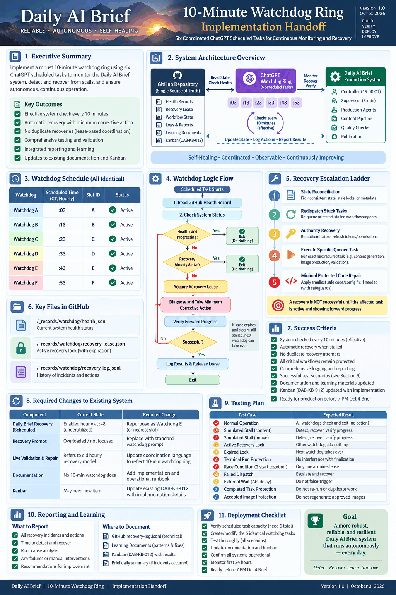

# ChatGPT Watchdog Ring

**Status:** current production liveness contract  
**Scope:** outer autonomous recovery for `gttome/Daily-AI-Brief`  
**Timezone:** `America/Chicago`

This document is intentionally generic. It must never depend on a historical run name, execution ID, branch, edition ID, or run number.

## Purpose — fix the problem and restore proven progress

> [!IMPORTANT]
> **The Watchdog Ring is a repair system, not a monitoring, alerting, status-reporting or retry-only system.**
>
> When a genuine stall or actionable failure is detected, the Watchdog's job is **not complete** when it identifies the problem, records the problem, acquires a lease, retries a command, dispatches a worker, refreshes a queue, updates the Kanban, changes a status, or produces another orchestration heartbeat.
>
> Its required outcome is to **fix the problem and restore autonomous forward progress for the same execution**.

For every genuine `STALE_ACTIVE` or `BLOCKED_ACTIONABLE` condition, the Watchdog must drive the affected task/process through this outcome sequence:

1. **Diagnose** the actual cause of the stall from current authoritative evidence.
2. **Fix** that cause using the smallest safe authorized correction that actually resolves it.
3. **Activate** the affected task/process so it has a real eligible executor and is no longer merely queued, dispatched, nominally Active, or administratively updated.
4. **Verify executor activity** — prove a real worker or protected executor has claimed or entered the operation.
5. **Verify substantive forward progress** — prove durable movement beyond the recovery action itself.

The governing rule is:

> **Recovery is successful only when the affected task/process is active and demonstrably progressing again.**

If the first corrective action does not restore that condition, the Watchdog must continue to the **next-smallest authorized corrective action** while its recovery authority remains valid. It must not stop merely because an attempted fix was issued.

The phrase **minimum corrective action** means *minimum sufficient corrective action*: choose the smallest safe action that restores proven progress. It never means "make one small attempt and stop."

### Persistence rule — quitting is not an option for an actionable stall

For a genuine actionable stall, **one failed repair attempt can never end recovery**. The current Watchdog must continue through every remaining applicable safe authorized option in the Fix-to-Progress ladder while it retains valid recovery authority.

If the current invocation reaches a safe execution boundary before progress is restored, that boundary is a **handoff**, not a recovery result. Persist the unresolved incident, the exact attempted action keys, the current blocker, and the next authorized action; release cleanly; and leave the incident marked recovery-required so the next Watchdog slot resumes it.

`BLOCKED_EXTERNAL` is permitted only when current evidence proves the blocker is genuinely external and non-actionable under the authorized system boundaries. **Exhausting local repair attempts does not by itself make a blocker external.** Re-read and re-diagnose from fresh authoritative state first.

Therefore the only normal outcomes of an actionable Watchdog recovery are:

- **ACTIVE + PROGRESSING** — real executor plus substantive durable progress are proven; or
- **CONTINUATION HANDOFF** — the issue remains actionable and the next Watchdog must continue; or
- **VERIFIED EXTERNAL BLOCK** — no safe authorized internal repair exists at present; or
- **TERMINAL EXECUTION** — production work is already finished/closed and immutable.

There is no "tried once and gave up" outcome.

## Architecture

The Daily AI Brief uses four liveness roles:

1. **Run Supervisor** — normal orchestration, approximately one-minute loop.
2. **GitHub Supervisor watchdog** — every five minutes, restarts the same active Supervisor execution when missing.
3. **ChatGPT Watchdog Ring** — six ordinary hourly Scheduled tasks staggered at minutes **03, 13, 23, 33, 43 and 53**, producing a nominal ten-minute outer recovery check.
4. **Daily live validation/repair** — independent reader/publication validation.

The ring supplements rather than replaces the GitHub control plane.

## Schedule contract

| Slot | Minute each hour | Timing |
|---|---:|---|
| A | 03 | exact_schedule |
| B | 13 | exact_schedule |
| C | 23 | exact_schedule |
| D | 33 | exact_schedule |
| E | 43 | exact_schedule |
| F | 53 | exact_schedule |

Each member recurs once per hour. Platform delivery can be late; safe overlap comes from the recovery lease and idempotency.

All six slots are operationally equivalent. The Ring itself is the durable reusable native-image consumer pool. Any slot may consume the exact next queued native-image request for Tasks 11–16; the only intended differences between slots are the slot letter and scheduled minute.

## Healthy fast path

Resolve only current protected durable production state. Exit without mutation when there is no active nonterminal execution, the execution is terminal, another Watchdog owns an unexpired recovery lease, a real worker/protected executor is progressing, health is `HEALTHY_ACTIVE`, or `READY_IDLE` is legitimate.

Healthy checks create no commits, incidents, Kanban refreshes, queue rewrites, worker dispatches, or writer-lease changes.

## Authority and health

Append-only task events and exact worker requests/results are production authority. Kanban, timing, metrics, heartbeats and status-only commits are observability.

The ring reuses: `HEALTHY_ACTIVE`, `READY_IDLE`, `STALE_ACTIVE`, `BLOCKED_ACTIONABLE`, `BLOCKED_EXTERNAL`, and `TERMINAL`.

## Recovery coordination lease

Path:

```text
_records/edition-execution/watchdog-leases/<execution-id>.json
```

Schema: `chatgpt-watchdog-recovery-lease-v1`.

The execution-scoped lease lasts approximately 12–15 minutes and uses optimistic Git blob concurrency. An update must present the exact current file SHA; a lost race re-reads and exits if another owner won.

The recovery lease is **not** the production writer lease. Every production mutation still requires the existing execution-specific writer fence.

## Idempotency

A deterministic incident ID binds execution, task, authoritative state, blocker/reason, and exact request. A deterministic action key binds incident, action type, target, and attempt generation. Successful or active action keys are not duplicated. Failed actions escalate instead of blind retry.

## Fix-to-Progress Recovery Ladder

The Watchdog must select the **smallest safe action that can actually restore active progress**, then verify the result. The ladder is ordered from least invasive to most invasive:

1. `RECONCILE_AUTHORITATIVE_STATE` — repair stale derived state when authoritative evidence already proves the task can advance.
2. `REDISPATCH_SAME_EXECUTOR` — restart or re-dispatch the same Supervisor, worker, or protected executor for the same execution/request.
3. `RESTORE_SAME_EXECUTION_AUTHORITY` — restore writer/recovery authority only after the prior owner is proven dead or released.
4. `CONSUME_EXACT_QUEUED_REQUEST` — execute the exact newest authoritative request without broadening scope.
5. `MINIMAL_PROTECTED_REPAIR` — correct the smallest deterministic code/configuration defect through the protected path when existing primitives cannot restore progress.
6. If the blocker is genuinely external and cannot safely be corrected, persist exact blocker evidence and stop at the safe boundary.

After **every** action, the Watchdog must ask two separate questions:

- **Is the affected task/process active under a real executor?**
- **Is there substantive durable evidence that it is progressing?**

If either answer is **no**, recovery is not complete. Continue to the next-smallest authorized action rather than declaring success or waiting for the owner.

Never allocate another execution, reopen a terminal execution, redo a Done task, regenerate an `accepted_locked` image, steal a live writer, or bypass protected CI/deploy/verification.

## Native image consumption — six-slot consumer pool

The Watchdog Ring itself is the registered reusable native-image consumer. **A, B, C, D, E and F have identical image capability.** There is no F-specific production role.

For Tasks 11–16, a legitimately queued, unclaimed `native_chatgpt` request does **not** need to become stale or blocked before a Watchdog may act. The next eligible slot may immediately consume the exact authoritative request.

Normal image-consumer flow:

1. Read the exact first-incomplete Task 11–16 and its newest authoritative queued request.
2. Verify no real image worker/current writer already owns or is progressing that exact request.
3. Acquire current task-specific fenced writer authority. Request-embedded generation is provenance only.
4. Generate from the sealed single-story professional specification.
5. Persist the exact returned bytes through the approved Git route and verify content identity/read-back.
6. Review the saved Git image and either record `accepted_locked` or exact bounded rejection/recovery evidence.
7. Release at the durable task boundary and hand back to the Supervisor.

The writer fence makes overlapping slot wakes safe: **one exact request → one current writer → one image generation**. A later slot yields when another slot owns the request and can take over only after the existing authority is proven released/dead under the recovery contracts.

### Image-task coverage improvement

Before this change, one designated hourly consumer (F) represented the reusable scheduled image-consumer binding. After this change, all six staggered Watchdog slots are eligible consumers.

| Image-consumer coverage | Before | Current |
|---|---:|---:|
| Eligible recurring scheduled consumers | 1 | 6 |
| Scheduled consumer opportunities per hour | 1 | 6 |
| Nominal maximum wait to next scheduled consumer | up to ~60 min | up to ~10 min |
| Requires task to become stale before normal pickup | No, but only designated consumer could pick it up | **No; next eligible slot may pick it up** |
| Duplicate generation protection | writer/fence | **writer/fence + exact request + equivalent-slot contract** |

This is **materially better coverage for the image tasks**, which are the most operationally fragile part of the Brief. The ten-minute value is a nominal schedule spacing, not a real-time delivery guarantee.

## Recovery verification — active **and** progressing

A Watchdog may declare recovery only after it proves **both** of the following:

1. **Active:** the affected task/process has a real executor or protected external executor actually working on it; and
2. **Progressing:** substantive durable evidence shows that work is moving forward after the repair.

Qualifying progress includes a task transition, worker claim/result, accepted asset, first-incomplete-task advance, bounded repair completion, meaningful protected CI/deploy/verification state advancement, or publication/verification evidence.

The following are explicitly **not** recovery success: lease acquisition/renewal, Supervisor or Watchdog heartbeat, Kanban refresh, metric/timing update, queue rewrite, status-only commit, rereading the same state, retry command, workflow dispatch, or any "Active" label without a real executor and subsequent durable movement.

A repair whose purpose is to get a task active must therefore verify the entire chain:

```text
problem diagnosed → cause fixed → task/process active → real executor confirmed → durable progress confirmed
```

If that chain is incomplete, the Watchdog must continue recovery using the next-smallest authorized action. It must exhaust the applicable safe authorized options before yielding. A required safe-boundary yield is an unresolved continuation handoff to the next slot, not recovery success.

## Incident evidence

Actual stalls/recoveries only:

```text
_records/edition-execution/watchdog-events/<execution-id>/
```

Events are append-only `chatgpt-watchdog-event-v1`. Healthy checks write nothing.

Allowed release reasons: `RECOVERY_VERIFIED_PROGRESSING`, `RECOVERY_NO_LONGER_NEEDED`, `WAITING_ON_PROTECTED_EXTERNAL_EXECUTOR`, `BLOCKED_EXTERNAL`, `TERMINAL_EXECUTION`, `SAFE_BOUNDARY_REACHED`.

Do not hold a recovery lease while waiting on a long protected external workflow.

## Cost boundary

Ordinary Scheduled ChatGPT plus connected GitHub only. No ChatGPT Work, Codex, paid model API/service, billable overage, event-triggered Work task, alternate account, browser-login automation, or new credentials.

## Regression suite

`_generator/test/chatgpt-watchdog-ring.test.mjs` covers healthy/no-active/terminal cases, recovery ownership and expiry, optimistic concurrency preconditions, post-acquisition races, exact request selection, minimum action and escalation, external blocks, projection authority, completed-task/accepted-asset protection, verification, and five bounded synthetic integration cases.

## Operator schedule reference

The permanent ChatGPT Watchdog Ring consists of **exactly six enabled recurring Scheduled tasks**. All six use the same generic recovery state machine; only the slot identifier and minute offset differ.

| Scheduled task | Slot | Minute each hour | Expected status | Permanent role |
|---|---:|---:|---|---|
| Daily Brief Watchdog A | A | :03 | Enabled | Recovery + native-image consumer |
| Daily Brief Watchdog B | B | :13 | Enabled | Recovery + native-image consumer |
| Daily Brief Watchdog C | C | :23 | Enabled | Recovery + native-image consumer |
| Daily Brief Watchdog D | D | :33 | Enabled | Recovery + native-image consumer |
| Daily Brief Watchdog E | E | :43 | Enabled | Recovery + native-image consumer |
| Daily Brief Watchdog F | F | :53 | Enabled | Recovery + native-image consumer |

The effective nominal sequence is therefore:

```text
:03 A → :13 B → :23 C → :33 D → :43 E → :53 F → next hour :03 A
```

The cadence is nominal rather than real-time guaranteed; Scheduled task delivery can start late. Recovery-lease coordination and idempotent action keys make late or overlapping invocations safe.

### No slot is special

Slot F retains its historical automation identity because the former hourly Recovery task was repurposed rather than deleted. **That identity no longer grants F any unique production capability.**

A–F use the same state machine, image-consumer rules, recovery ladder, cost boundary, writer-fence rules and success criteria. Slot identity is scheduling metadata only.

The old standalone :48 recovery behavior remains retired.

### If any Watchdog slot is not visible in the ChatGPT Scheduled Tasks UI

The intended live configuration is six enabled Watchdog tasks A–F. If any one of the six is missing from the Scheduled Tasks screen:

1. refresh or reopen the Scheduled Tasks view;
2. look for the exact **Daily Brief Watchdog A–F** titles;
3. confirm the six hourly minute offsets are **:03, :13, :23, :33, :43 and :53**;
4. if any slot remains absent after refresh, treat that as a schedule-configuration and image-coverage defect before the next production run.

Do not create a replacement slot blindly. First verify live schedule state so the system does not accidentally create duplicate recovery/image consumers. The one-owner writer-fence rule protects production requests, but schedule duplication is still a configuration defect.

## Watchdog Permission Probe

The **Watchdog Permission Probe** is **not a member of the Watchdog Ring**.

It was a bounded, one-time, non-production implementation test whose only purpose was to prove that an ordinary ChatGPT Scheduled task could use the connected GitHub capability unattended. The probe was constrained to an isolated test branch and was not allowed to modify protected `main`, any production execution branch, production pointers, writer leases, accepted assets or publication state.

The probe verified the ability to:

1. run unattended as a normal Scheduled task;
2. read protected repository state through the connected GitHub capability;
3. write one harmless verification record to an isolated non-production branch without interactive approval;
4. preserve production state completely.

After the test completed, the probe was disabled. It must remain disabled and must **not** be counted when verifying the six permanent ring members.

A UI may continue to show the disabled/completed probe as historical Scheduled-task evidence. Its presence does not mean there are seven Watchdog slots.

## Schedule verification checklist

When checking the Watchdog Ring before a production run, verify all of the following:

- exactly six recurring Watchdog members are enabled;
- the recurring minutes are exactly **03, 13, 23, 33, 43 and 53**;
- all six slots A–F are present and enabled;
- all six are eligible native-image consumers under the same contract;
- no standalone :48 Daily Brief Recovery schedule remains enabled;
- every Watchdog prompt is generic and contains no historical production identity;
- the daily production Controller remains separate from the ring;
- the daily live validator remains separate from the ring;
- the GitHub five-minute Supervisor watchdog remains enabled and unchanged;
- the one-time Watchdog Permission Probe is disabled and is not counted as a ring member;
- no event-triggered Work task, Work/Codex route, paid API/service, alternate account, new credential or browser automation has been introduced.

## Source-of-truth rule

The **live ChatGPT Scheduled-task definitions** determine whether a schedule is actually enabled and when it will run. This living document records the required architecture and expected configuration; it is not itself the scheduler.

Whenever a permanent Watchdog schedule, role, minute offset, recovery-lease rule or image-consumer binding changes, update this document in the same protected change set so the living operations documentation and the live system do not drift.


## Living infographic

The current Watchdog Ring architecture infographic is maintained at:

- `docs/images/living-architecture/Daily-AI-Brief-Watchdog-Ring-Architecture-v1.0.svg`
- final equivalent-consumer verification: `_records/hardening/chatgpt-watchdog-ring-2026-10-03/equivalent-image-consumer-pool-final-verification.json`

The diagram must show A–F as operationally equivalent, six-slot native-image coverage, GitHub as durable authority, one-owner duplicate-generation protection, the Run Supervisor handoff, and Fix-to-Progress continuation semantics.

## Professional implementation infographic

The detailed implementation-reference infographic for the Watchdog Ring is:



This PNG is the professional, color, detailed implementation-reference view of the ring: six identical staggered Watchdogs, GitHub durable state, recovery lease coordination, Fix-to-Progress flow, escalation ladder, testing, reporting and deployment checklist.

Because the graphic is explicitly a dated **Implementation Handoff**, it is supporting implementation documentation rather than the evergreen architecture authority. The evergreen system contract remains the generic architecture diagram and this document's current production rules.

---

## Protected Repair Autonomy — mandatory control-plane behavior

The Watchdog Ring MUST NOT stop at a protected-repository boundary. **Diagnosis without completion is not autonomous recovery.**

Invariant:

\`actionable_recovery_must_not_terminate_at_owner_prompt_boundary\`

When any equivalent Watchdog A–F proves an actionable incident requires a bounded protected repair, it must continue the same incident through this durable sequence:

\`actionable incident → bounded repair branch → PROTECTED_REPAIR_REQUIRED → exactly one protected PR → exact-head deterministic CI → safe merge → SAME_TASK_RESUME_REQUIRED → same execution/task resumes → real executor active → substantive durable progress\`

Mandatory rules:

- A–F remain functionally equivalent. No slot owns a special repair role.
- The Watchdog persists a \`protected-repair-required-v1\` record under \`_records/edition-execution/protected-repairs/<execution-id>/\` after the bounded repair branch/head and repair scope digest are known.
- The repair identity is deterministic over execution, task, incident and repair-scope digest. Duplicate Watchdogs reuse the exact same repair identity and may not open duplicate PRs.
- \`.github/workflows/protected-repair-executor.yml\` is the repository-native promotion path. A Watchdog that has prepared the bounded repair must invoke or rely on this executor instead of handing the owner “PR needed.”
- If the executor is genuinely advancing the same repair, later Watchdogs yield. If it has failed, a later Watchdog continues from the exact failed stage rather than rediscovering the incident.
- PR creation, CI dispatch, CI PASS, merge, queue rewrite, lease acquisition, heartbeat, and Kanban refresh are **intermediate states**, not recovery success.
- Recovery success requires the same production task to resume, a real executor to be active, and substantive durable production movement to be proven.
- \`REPAIR_CI_FAIL\`, \`REPAIR_HEAD_CHANGED\`, \`REPAIR_EXECUTION_MISMATCH\`, \`REPAIR_MERGE_CONFLICT\`, and \`REPAIR_RESUME_FAILED\` remain recoverable unless an exact external blocker is proved.
- Routine PR creation, CI retry, dead-writer cleanup, merge and same-task resume are not owner dependencies when the already-authorized GitHub connection can perform them safely.

### Dead-writer rule

A long wall-clock writer lease does not keep a failed GitHub Actions owner alive. An unexpired writer may be superseded only when the exact owner maps to a GitHub Actions run that is \`completed\` with conclusion \`failure\` or \`cancelled\`, no child/subworker remains live under that generation, and no substantive write occurred after terminal time. The supersession persists append-only \`dead-writer-recovery-v1\` evidence with the old and replacement generations.

A healthy or unproven writer is never stolen. Native-image task handoff remains an explicit exact-task authority transfer, not dead-writer takeover.

