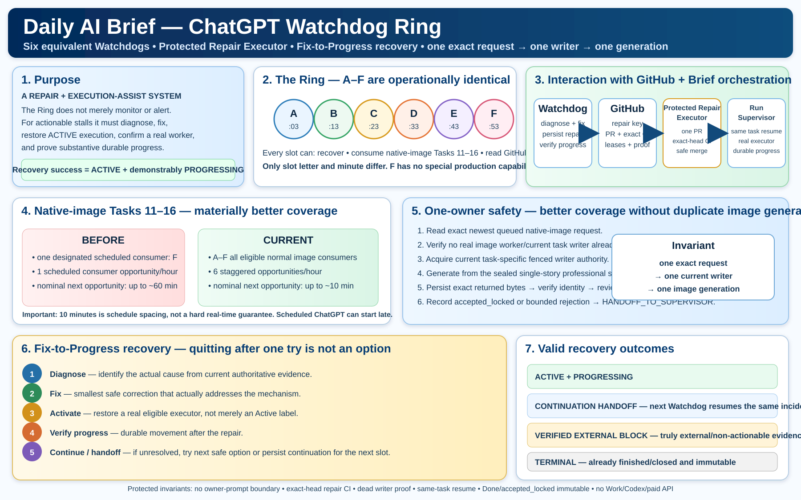

# Daily AI Brief — Living Architecture Infographics

**Status:** evergreen living documentation projection  
**Version:** v3.4

> [!IMPORTANT]
> These diagrams explain the durable Daily AI Brief system architecture. They are **not run-status dashboards**. Machine evidence remains authoritative for live state.

<!-- oct4-field-validation-note -->
## October 4 field-validation note

The Watchdog Ring v1.1 diagram remains an accurate **as-implemented liveness architecture** for the six equivalent slots, but Run 8 proved that it is not yet the desired steady-state efficiency architecture. A future living-architecture revision should be generated **after** the pending hardening is implemented and verified, showing:

- deterministic compact health polling;
- ChatGPT as semantic escalation rather than routine polling;
- Strategy Interrupt / meta-diagnostic escalation;
- story-only native-image generation context separated from recovery reasoning;
- complete Task 29 incident inventory;
- semantic reader parity before PUBLIC_CLOSED.

Do not redraw the living diagram to imply these controls already exist. Until implementation, DAB-KB-033 through DAB-KB-037 are the authoritative pending changes.

## Current architecture amendment

**Protected Repair Autonomy:** the Watchdog Ring now has a repository-native Protected Repair Executor for bounded repair promotion through one PR, exact-head CI, safe merge and same-task resume. Dead GitHub Actions writers require exact terminal evidence before supersession. Recovery success still requires a real executor plus substantive durable progress.

**Watchdog Ring image-consumer pool:** all six slots A–F are operationally equivalent. Each is both an outer recovery worker and an eligible scheduled native-image consumer for Tasks 11–16. A normal queued unclaimed image request is consumed by the next eligible slot without waiting for stale classification. One exact request + one current writer fence prevents duplicate generation. The living diagrams must show this six-slot image coverage explicitly and must not depict F as special.

## Current diagrams

### ChatGPT Watchdog Ring — equivalent image-consumer architecture

This current diagram is the scalable architecture source for the six-slot Watchdog Ring. It shows A–F as equivalent recovery/image-consumer slots, the nominal 10-minute stagger, GitHub durable authority, Run Supervisor interaction, native-image coverage improvement, one-owner duplicate-generation protection, and the Fix-to-Progress recovery ladder.

### Professional Watchdog implementation reference — dated supporting asset

This high-detail color PNG is the **implementation-reference** companion to the evergreen Watchdog architecture. It provides the implementation handoff, six-slot schedule table, health/recovery flow, escalation ladder, GitHub records, tests, reporting/learning and deployment checklist.

**Scope boundary:** this PNG contains dated implementation-handoff context, so it is intentionally **not** the evergreen living-architecture authority and does not replace `Daily-AI-Brief-Watchdog-Ring-Architecture-v1.1.svg`. Preserve it as implementation evidence/reference while keeping the generic SVG as the current durable architecture projection.

### Persistent Run Supervisor architecture

### Current operating contract and living architecture

## Permanent scope rule

The current architecture infographics must contain only durable system-level concepts: control-plane roles, state authorities, writer fencing and handoff, task/recovery contracts, image execution, publication gates, learning architecture, derived projections, and system invariants.

They must **not** contain:

- run numbers or execution IDs;
- edition dates or observation dates;
- a particular run's success/failure/closure state;
- one-off rehearsal names or outcomes;
- temporary start windows, current-day readiness windows, or transitional run-specific guards;
- any other status that becomes false merely because the next run starts.

Those facts belong in event-derived Kanban/status dashboards, append-only run evidence, or historical documentation.

## Professional visual-quality contract

Final living architecture assets must:

1. be **high-resolution, detailed, professional textbook-grade PNG infographics**;
2. meet or exceed the quality and information density of the established architecture reference PNGs;
3. use clear visual hierarchy, balanced panel density, disciplined spacing and professional iconography;
4. remain legible at full size and normal desktop viewing scale;
5. have no clipped/overlapping text, spelling errors, malformed labels, or low-information filler;
6. avoid sparse/basic box-and-arrow substitutes;
7. receive a final visible-text and visual-quality review before acceptance.

Programmatic SVGs or simple diagrams may be used as drafting/source aids, but they are **not acceptable final living architecture assets** unless their rendered result independently meets the same professional quality bar.

## Living-document maintenance rule

Refresh both current diagrams in the same protected documentation change whenever any of these materially changes:

- Daily Brief Controller, Run Supervisor, Watchdog Ring equivalent-slot/image-consumer responsibilities, writer-fence or handoff responsibilities;
- Watchdog Fix-to-Progress semantics, including continued escalation after a failed repair, ACTIVE+PROGRESSING success, and unresolved safe-boundary handoff;
- Task 00 readiness or Task 29 closure contracts;
- Task 00–29 recovery semantics;
- image qualification, reusable image consumer, exact-byte persistence or saved-Git review;
- publication authorization, protected CI, exact-SHA deployment or independent live verification;
- operational-learning ledger or invariant requirements;
- production Kanban architecture or its relationship to the persistent Improvement Kanban.

Preserve prior versions as historical evidence. Never silently overwrite an old version to make it appear contemporaneous.

## Acceptance gate

Before a living architecture infographic is accepted:

- [ ] no run-specific or date-specific operational status is present;
- [ ] every statement describes a durable system contract or role;
- [ ] Watchdog visuals do not imply one retry is enough; they show continued safe escalation until ACTIVE+PROGRESSING, verified external block, terminal state, or explicit continuation handoff;
- [ ] final output is a professional high-resolution PNG;
- [ ] visual quality is at least as strong as the established reference infographics;
- [ ] all visible text has been checked for correctness and legibility;
- [ ] no clipping, overlap, malformed labels or unintended carryover appears;
- [ ] the companion learning/operations documents are synchronized.

## Primary living sources

- `docs/operations/START-HERE.md`
- `docs/operations/DAILY-UNATTENDED-STARTUP.md`
- `docs/operations/RUN-LEARNING-READINESS-PLAN.md`
- `docs/operations/run-learning-readiness-contract.json`
- `docs/operations/task-recovery-contracts.json`
- `docs/operations/LIVING-SYSTEM-OPERATIONS.md`
- `docs/operations/PRODUCTION-CONTINUOUS-IMPROVEMENT-LEDGER.md`
- `data/operations/production-continuous-improvement-ledger.jsonl`
- `docs/operations/unattended-image-host.json`
- `.github/workflows/run-supervisor.yml`
- `.github/workflows/run-supervisor-watchdog.yml`
- `.github/workflows/run-supervisor-handoff.yml`
- `.github/workflows/repository-task-consumer.yml`
