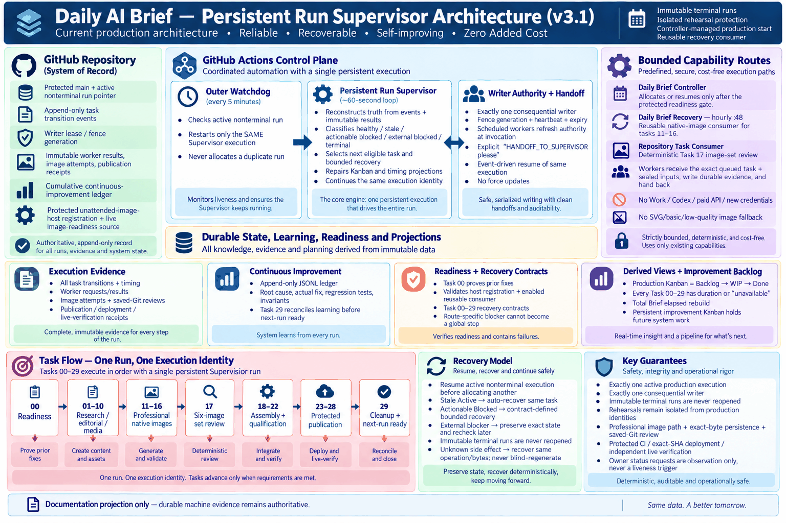
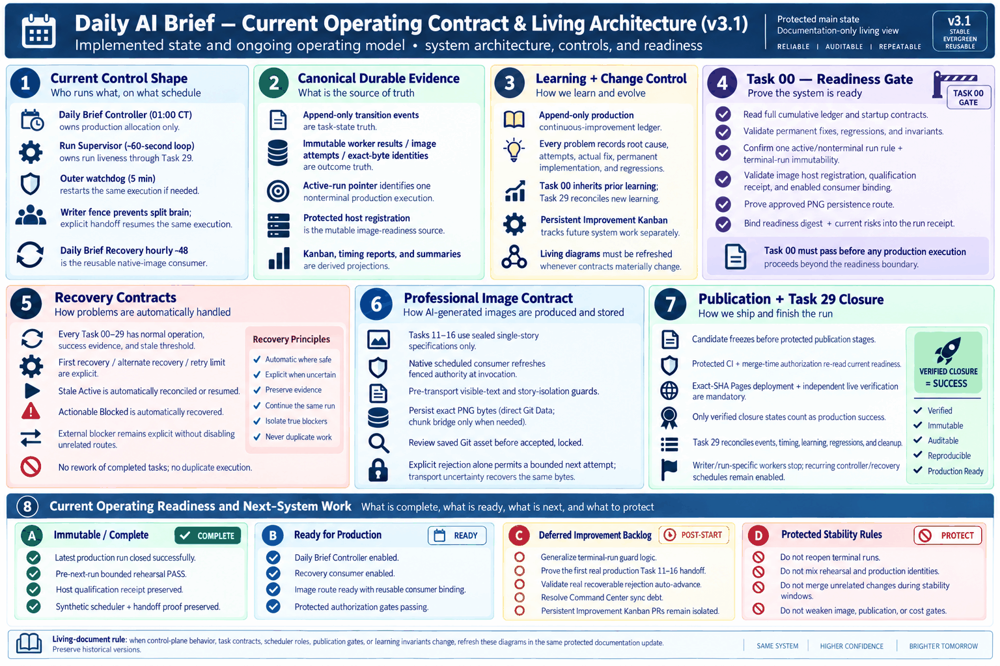

# Daily AI Brief — Living Architecture Infographics

**Status:** evergreen living documentation projection  
**Version:** v3.1

> [!IMPORTANT]
> These diagrams explain the durable Daily AI Brief system architecture. They are **not run-status dashboards**. Machine evidence remains authoritative for live state.

## Current diagrams

### Persistent Run Supervisor architecture

### Current operating contract and living architecture

## Permanent scope rule

The current architecture infographics must contain only durable system-level concepts: control-plane roles, state authorities, writer fencing and handoff, task/recovery contracts, image execution, publication gates, learning architecture, derived projections, and system invariants.

They must **not** contain:

- run numbers or execution IDs;
- edition dates or observation dates;
- a particular run's success/failure/closure state;
- one-off rehearsal names or outcomes;
- temporary start windows, current-day readiness windows, or transitional run-specific guards;
- any other status that becomes false merely because the next run starts.

Those facts belong in event-derived Kanban/status dashboards, append-only run evidence, or historical documentation.

## Professional visual-quality contract

Final living architecture assets must:

1. be **high-resolution, detailed, professional textbook-grade PNG infographics**;
2. meet or exceed the quality and information density of the established architecture reference PNGs;
3. use clear visual hierarchy, balanced panel density, disciplined spacing and professional iconography;
4. remain legible at full size and normal desktop viewing scale;
5. have no clipped/overlapping text, spelling errors, malformed labels, or low-information filler;
6. avoid sparse/basic box-and-arrow substitutes;
7. receive a final visible-text and visual-quality review before acceptance.

Programmatic SVGs or simple diagrams may be used as drafting/source aids, but they are **not acceptable final living architecture assets** unless their rendered result independently meets the same professional quality bar.

## Living-document maintenance rule

Refresh both current diagrams in the same protected documentation change whenever any of these materially changes:

- Daily Brief Controller, Run Supervisor, watchdog, writer-fence or handoff responsibilities;
- Watchdog Fix-to-Progress semantics, including continued escalation after a failed repair, ACTIVE+PROGRESSING success, and unresolved safe-boundary handoff;
- Task 00 readiness or Task 29 closure contracts;
- Task 00–29 recovery semantics;
- image qualification, reusable image consumer, exact-byte persistence or saved-Git review;
- publication authorization, protected CI, exact-SHA deployment or independent live verification;
- operational-learning ledger or invariant requirements;
- production Kanban architecture or its relationship to the persistent Improvement Kanban.

Preserve prior versions as historical evidence. Never silently overwrite an old version to make it appear contemporaneous.

## Acceptance gate

Before a living architecture infographic is accepted:

- [ ] no run-specific or date-specific operational status is present;
- [ ] every statement describes a durable system contract or role;
- [ ] Watchdog visuals do not imply one retry is enough; they show continued safe escalation until ACTIVE+PROGRESSING, verified external block, terminal state, or explicit continuation handoff;
- [ ] final output is a professional high-resolution PNG;
- [ ] visual quality is at least as strong as the established reference infographics;
- [ ] all visible text has been checked for correctness and legibility;
- [ ] no clipping, overlap, malformed labels or unintended carryover appears;
- [ ] the companion learning/operations documents are synchronized.

## Primary living sources

- `docs/operations/START-HERE.md`
- `docs/operations/DAILY-UNATTENDED-STARTUP.md`
- `docs/operations/RUN-LEARNING-READINESS-PLAN.md`
- `docs/operations/run-learning-readiness-contract.json`
- `docs/operations/task-recovery-contracts.json`
- `docs/operations/LIVING-SYSTEM-OPERATIONS.md`
- `docs/operations/PRODUCTION-CONTINUOUS-IMPROVEMENT-LEDGER.md`
- `data/operations/production-continuous-improvement-ledger.jsonl`
- `docs/operations/unattended-image-host.json`
- `.github/workflows/run-supervisor.yml`
- `.github/workflows/run-supervisor-watchdog.yml`
- `.github/workflows/run-supervisor-handoff.yml`
- `.github/workflows/repository-task-consumer.yml`
