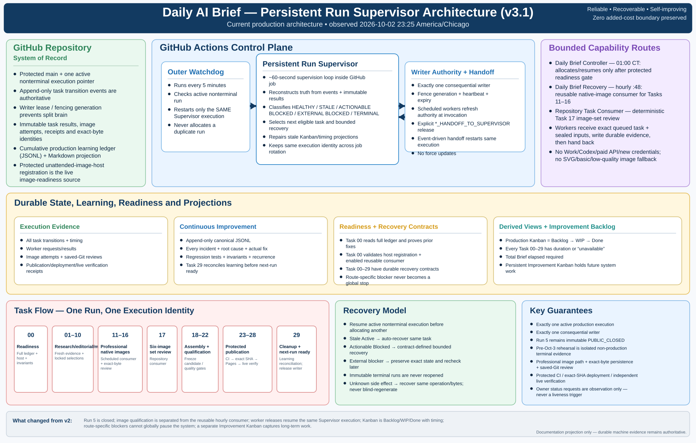
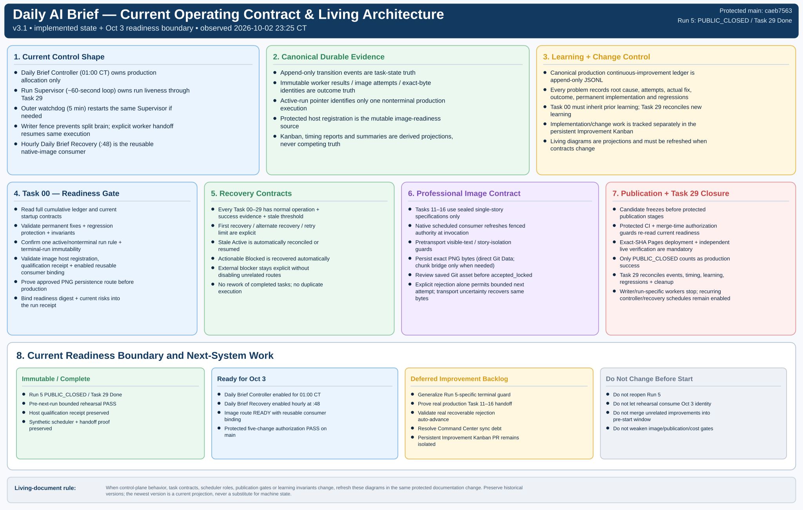

# Daily AI Brief — Living Architecture Infographics

**Status:** living documentation projection  
**Version:** v3.1  
**Observed:** 2026-10-02 23:25 America/Chicago  
**Protected-main baseline reviewed:** `caeb7563241fac1c1450b8545baac9faea38f325`

> [!IMPORTANT]
> These diagrams are human-readable projections of the current operating architecture. Durable machine evidence remains authoritative: protected run pointers, append-only task events, immutable worker/image results, writer leases, readiness receipts, host registration, publication evidence, and the canonical production continuous-improvement ledger.

## Current diagrams

### Persistent Run Supervisor architecture

### Current operating contract and living architecture

## What changed from the v2 infographics

The v2 diagrams described the approved target architecture while Run 4 was still being completed. The current implementation is materially different and more mature:

- Run 5 is terminal `PUBLIC_CLOSED` / Task 29 Done and is immutable.
- Production allocation is owned by the enabled **Daily Brief Controller** at 01:00 America/Chicago; a start trigger is not the liveness mechanism.
- The GitHub **Run Supervisor** now runs an approximately 60-second persistent loop and the outer watchdog checks every five minutes, always resuming the same execution.
- Writer authority is fenced. Scheduled workers refresh current authority at invocation and explicitly release with `*_HANDOFF_TO_SUPERVISOR`.
- Native image qualification and native image consumption are separate contracts. Protected `docs/operations/unattended-image-host.json` is the mutable readiness source; the enabled hourly **Daily Brief Recovery** automation at :48 is the reusable Tasks 11–16 native-image consumer.
- Task 17 has a deterministic repository consumer for six-image set review.
- Route-specific blockers must not globally stop unrelated work.
- Production Kanban is exactly **Backlog → WIP → Done**, with every Task 00–29 showing a duration or `unavailable`, plus total Brief elapsed time and an event-ledger freshness digest.
- The cumulative production learning ledger is a Task 00 admission dependency and Task 29 closure dependency.
- A separate persistent **Improvement Kanban** is being introduced for system improvements, technical debt, validation follow-ups, and UX work; it is not the per-edition production Kanban.
- The pre-Oct-3 public rehearsal is isolated non-production evidence and must never consume the October 3 production identity.

## Living-document maintenance rule

Refresh these diagrams in the same protected documentation change whenever any of the following materially changes:

1. controller, Supervisor, watchdog, writer-fence, handoff, or worker responsibilities;
2. Task 00 readiness or Task 29 closure contracts;
3. Task 00–29 recovery semantics;
4. image qualification, image consumer, exact-byte persistence, or review path;
5. publication authorization, CI, exact-SHA deployment, or live-verification gates;
6. operational-learning ledger or invariant requirements;
7. production Kanban projection rules; or
8. the relationship between production execution and the persistent Improvement Kanban.

Preserve older infographic versions as historical evidence. Never silently rewrite an old version to make it appear contemporaneous.

## Current Oct 3 safety boundary

At this observation point, the protected production system is intentionally left unchanged before the October 3 start window. Run 5 remains terminal. The normal Controller remains scheduled for 01:00 America/Chicago. The hourly reusable image consumer remains enabled. Long-term changes such as replacing the transitional Run 5-specific recovery guard with a generic immutable-terminal-run rule belong in the Improvement Kanban and should be implemented only after the October 3 production transition is stable.

## Primary living sources

- `docs/operations/START-HERE.md`
- `docs/operations/DAILY-UNATTENDED-STARTUP.md`
- `docs/operations/RUN-LEARNING-READINESS-PLAN.md`
- `docs/operations/run-learning-readiness-contract.json`
- `docs/operations/task-recovery-contracts.json`
- `docs/operations/LIVING-SYSTEM-OPERATIONS.md`
- `docs/operations/PRODUCTION-CONTINUOUS-IMPROVEMENT-LEDGER.md`
- `data/operations/production-continuous-improvement-ledger.jsonl`
- `docs/operations/unattended-image-host.json`
- `data/operations/active-production-run.json`
- `data/operations/publication-status.json`
- `.github/workflows/run-supervisor.yml`
- `.github/workflows/run-supervisor-watchdog.yml`
- `.github/workflows/run-supervisor-handoff.yml`
- `.github/workflows/repository-task-consumer.yml`
