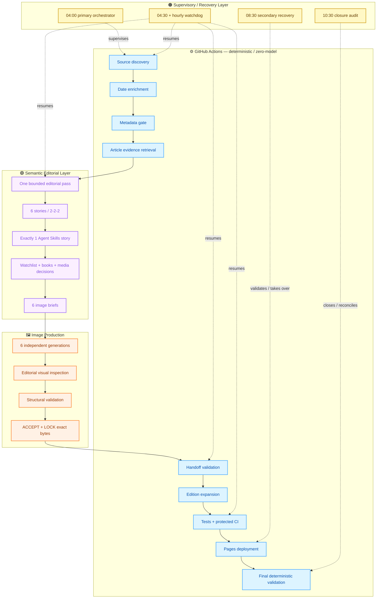
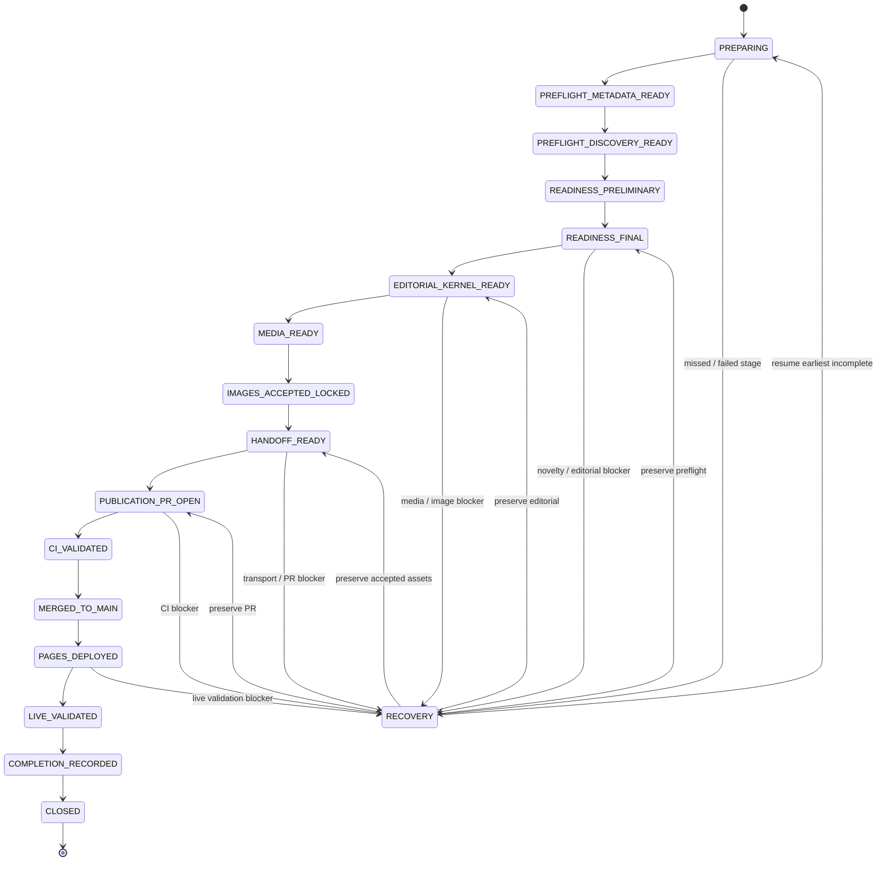
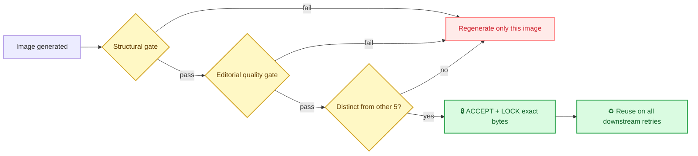
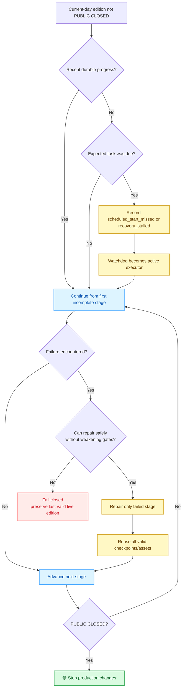
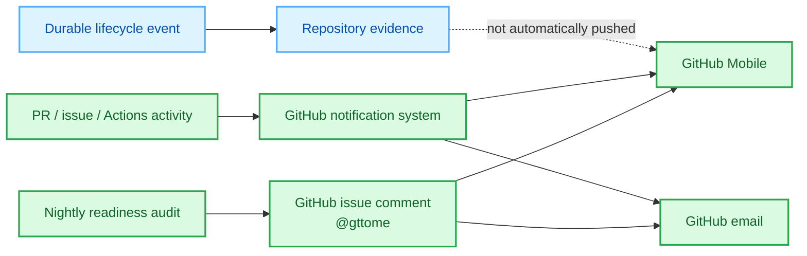

# Daily Generative AI Brief
## Living System Operations Reference

  
  
  
  

  <strong>Canonical human-readable operating model for the production Daily Generative AI Brief system</strong>

---

> [!IMPORTANT]
> **This is a living production document.**  
> It must describe what the system does **now**, not what it used to do. Any material change to schedules, stage ownership, quality gates, recovery logic, notifications, completion semantics, or recurring hardening controls must update this file.

> [!NOTE]
> **Execution authority order**
> 1. `docs/operations/under80-runtime-contract.json`
> 2. `docs/operations/efficiency-operating-policy.json`
> 3. **This document**
> 4. Historical runbooks, incident reports and implementation records

---

## Executive Control Panel

| Control | Current production rule | Visual status |
|---|---|---|
| **Repository** | `gttome/Daily-AI-Brief` | 🟦 Source of truth |
| **Production branch** | `main` | 🟩 Protected |
| **Daily success condition** | `PUBLIC CLOSED` | 🟢 Required |
| **Story count** | Exactly **6** | 🟢 Fixed |
| **Story allocation** | **2 Technical / 2 Applied / 2 Agents** | 🟢 Fixed |
| **Agent Skills** | Exactly **1** qualifying story | 🟢 Required |
| **Videos** | Exactly **2** | 🟢 Required |
| **Podcasts** | Exactly **2**, source-diverse | 🟢 Required |
| **Story images** | Exactly **6**, professional, accepted + locked | 🟢 Required |
| **Low-quality image fallback** | Prohibited | 🔴 Never |
| **Broad restart after downstream failure** | Prohibited | 🔴 Never |
| **Recovery model** | Resume from first incomplete stage | 🟢 Mandatory |
| **Protected CI bypass** | Prohibited | 🔴 Never |
| **Completion proxy** | PR / merge / deploy / live page alone | 🔴 Insufficient |
| **True completion** | Main SHA = Pages SHA = validated edition = completion evidence = `CLOSED` | 🟢 Required |

---

## Visual Legend

| Symbol | Meaning |
|:---:|---|
| 🟢 | Required / healthy / accepted |
| 🟡 | Warning / recoverable attention |
| 🔴 | Prohibited / blocking failure |
| 🔵 | Durable checkpoint / system state |
| 🟣 | Editorial / semantic work |
| 🟠 | Recovery / watchdog / repair |
| ⚙️ | Deterministic GitHub automation |
| 🔒 | Immutable or protected |
| 📣 | Owner notification |
| 📌 | Durable evidence |
| ♻️ | Reuse existing valid work |
| 🧪 | Validation / test |
| 🚀 | Promotion / deployment |

---

## System at a Glance

> [!TIP]
> The system is intentionally **checkpoint-driven rather than clock-driven**. Schedules initiate supervision; durable repository state determines the next action.

---

# Table of Contents

- [1. Daily Production Schedule](#1-daily-production-schedule)
- [2. End-to-End Production Architecture](#2-end-to-end-production-architecture)
- [3. Complete Normal Production Process — 88 Steps](#3-complete-normal-production-process--88-steps)
- [4. Recovery and Self-Healing Model](#4-recovery-and-self-healing-model)
- [5. Troubleshooting & Hardening Ledger](#5-troubleshooting--hardening-ledger)
- [6. Failure Classification Playbook](#6-failure-classification-playbook)
- [7. Owner Notifications & Alerts](#7-owner-notifications--alerts)
- [8. Notification Event Catalog](#8-notification-event-catalog)
- [9. Continuous Hardening Rules](#9-continuous-hardening-rules)
- [10. Living-Document Maintenance Contract](#10-living-document-maintenance-contract)
- [11. Daily Completion Checklist](#11-daily-completion-checklist)
- [12. Related Production References](#12-related-production-references)

---

# 1. Daily Production Schedule

## Daily supervisory cadence

```mermaid
gantt
    title Daily Generative AI Brief — America/Chicago
    dateFormat HH:mm
    axisFormat %H:%M

    section Prior Evening
    Nightly readiness + owner notification :done, ready, 21:30, 30m

    section Zero-Model Prework
    Metadata preflight                   :active, meta, 03:00, 15m
    Evidence preflight                   :evidence, 03:15, 30m

    section Production
    Primary Production Orchestrator      :prod, 04:00, 4h
    Hourly Recovery Watchdog             :crit, recover, 04:30, 6h

    section Independent Supervisors
    Live Validation + Secondary Recovery :validate, 08:30, 90m
    Closure Audit                        :close, 10:30, 60m
```

### Schedule table

| Time — America/Chicago | Control | Responsibility | If prior work did not run |
|---|---|---|---|
| **21:30 prior evening** | 📣 GitHub-native Nightly Readiness | Verify next-run structural readiness and notify owner | Record attention state |
| **~03:00** | ⚙️ Metadata Preflight | Fresh zero-model source discovery and bounded metadata shortlist | Later supervisor may trigger missing prework |
| **~03:15** | ⚙️ Evidence Preflight | Build bounded nine-candidate evidence package | Later supervisor repairs only missing evidence stage |
| **04:00** | 🟣 Production Orchestrator | Primary run from current durable state through `PUBLIC CLOSED` | 04:30 watchdog takes over |
| **04:30 + hourly** | 🟠 Publication Recovery Supervisor | Detect missed starts/stalls and continue from last valid checkpoint | **Immediately becomes executor** |
| **08:30** | 🧪 Live Validation & Secondary Recovery | Independently verify progress/live state; take over if primary path stalled | Becomes recovery executor |
| **10:30** | 📌 Closure Audit | Final lifecycle, Command Center and documentation reconciliation | Repairs remaining safe gaps |
| **After closure** | 🔵 Command Center reconciliation | Reflect final production SHA and final edition state | May be degraded independently without reopening public edition |

> [!WARNING]
> A schedule being **enabled** is not evidence that it **ran**.  
> A scheduled start that produces no current-day durable progress is classified as `scheduled_start_missed` and triggers takeover.

---

# 2. End-to-End Production Architecture

## Ownership map

## Lifecycle state machine

> [!IMPORTANT]
> **Recovery always moves from the last valid checkpoint forward.**  
> It does not automatically jump backward to discovery or regenerate accepted assets.

---

# 3. Complete Normal Production Process — 88 Steps

## Phase Map

| Phase | Steps | Purpose | Primary owner |
|---|---:|---|---|
| 🌙 **A — Night-Before Readiness** | 1–6 | Confirm the system is structurally ready | GitHub Actions |
| ⚙️ **B — Zero-Model Research Prework** | 7–15 | Build bounded metadata shortlist | GitHub Actions |
| ⚙️ **C — Deep Evidence Preflight** | 16–20 | Build nine-candidate evidence packet | GitHub Actions |
| 🔵 **D — Readiness Certification** | 21–25 | Authorize or block publication | Orchestrator + durable receipts |
| 🟣 **E — Editorial Semantic Pass** | 26–34 | Select/write the six-story edition | Semantic editorial layer |
| 🎧 **F — Watchlist, Media & Reader Support** | 35–42 | Freeze Watchlist/media/book support | Editorial + verification |
| 🖼️ **G — Image Production** | 43–50 | Produce and lock six premium images | Image generation + quality gate |
| 🔒 **H — Atomic Handoff** | 51–57 | Freeze all semantic assets atomically | Git Data API |
| 🔵 **I — Publication PR / Expansion** | 58–62 | Create one candidate and expand release | GitHub |
| 🧪 **J — Protected CI / Promotion** | 63–68 | Test exact candidate and merge safely | Protected CI |
| 🚀 **K — Pages Deployment** | 69–71 | Deploy exact production SHA | GitHub Pages |
| 🧪 **L — Independent Live Validation** | 72–82 | Prove reader-facing release works | Validation supervisor |
| 🟢 **M — Completion & Closure** | 83–88 | Persist proof and declare `PUBLIC CLOSED` | Closure audit |

---

<strong>🌙 Phase A — Night-Before Readiness · Steps 1–6</strong>

| # | Process | Required result |
|---:|---|---|
| **1** | **Nightly readiness trigger** | GitHub Actions runs the readiness audit during the 21:00 Central hour using the 21:30 trigger. |
| **2** | **Repository health check** | Required workflows, contracts, tools and production files are accessible. |
| **3** | **Schedule readiness check** | Next-day production/recovery chain is enabled and structurally consistent. |
| **4** | **Publication infrastructure check** | Protected branch, required CI, Pages and publication paths are available. |
| **5** | **Readiness report** | A dated Markdown readiness record is persisted. |
| **6** | **Owner notification** | GitHub posts an `@gttome` issue comment so GitHub Mobile/email can surface the result according to owner settings. |

> [!TIP]
> This is the primary **phone-notification-capable** readiness mechanism because the notification is generated inside GitHub.

---

<strong>⚙️ Phase B — Zero-Model Research Prework · Steps 7–15</strong>

| # | Process | Required result |
|---:|---|---|
| **7** | **Establish edition date + cutoff** | Current America/Chicago edition date and research cutoff are recorded. |
| **8** | **Fresh metadata discovery** | Approved primary-source channels are scanned with zero model calls. |
| **9** | **Bound discovery breadth** | Acquisition stops at configured source and character budgets. |
| **10** | **Resolve publication/update dates** | Bounded deterministic date enrichment is performed. |
| **11** | **Deterministic metadata filtering** | Stale, invalid, duplicate, unresolved and low-value items are removed. |
| **12** | **Retain ≤20 metadata candidates** | Bounded shortlist is written to the preflight branch. |
| **13** | **Coverage gate** | ≥3 viable metadata candidates exist in each focus category. |
| **14** | **Agent Skills gate** | ≥1 story-ready Agent Skills signal exists and is prioritized. |
| **15** | **Metadata receipt** | `PREFLIGHT_METADATA_READY` is persisted with zero model calls. |

### Editorial allocation contract

| Position | Reader-facing focus | Count |
|:---:|---|:---:|
| 1–2 | 🧩 Technical AI Engineering | **2** |
| 3–4 | 💼 Applied Generative AI for Knowledge Workers | **2** |
| 5–6 | 🤖 Agents for Everyone | **2** |
| Across all six | 🧠 Qualifying reusable Agent Skills story | **Exactly 1** |

---

<strong>⚙️ Phase C — Deep Evidence Preflight · Steps 16–20</strong>

| # | Process | Required result |
|---:|---|---|
| **16** | **Select nine evidence candidates** | Exactly 9: **3 Technical + 3 Applied + 3 Agents**. |
| **17** | **Retrieve original evidence** | Authoritative source material is retrieved; downstream summaries do not substitute. |
| **18** | **Compact evidence** | Model-visible packet is **≤12,000 characters**. |
| **19** | **Verify Agent Skills candidate first** | Freshness, material change and 30-day novelty are checked. |
| **20** | **Evidence receipt** | `PREFLIGHT_DISCOVERY_READY` is persisted. |

> [!NOTE]
> The editorial model does **not** reopen the raw discovery queue and does **not** redo article network retrieval.

---

<strong>🔵 Phase D — Readiness Certification · Steps 21–25</strong>

| # | Process | Required result |
|---:|---|---|
| **21** | **Preliminary readiness** | Preflight integrity, evidence completeness, contracts and baseline SHA are checked. |
| **22** | **Novelty checks** | 30-day story-memory rule is applied. |
| **23** | **System gate checks** | No unresolved Critical/High blocker remains. |
| **24** | **Final readiness** | Durable state reaches `READINESS_FINAL`. |
| **25** | **Publication authorization** | Receipt records `publication_authorized=true`. |

> [!WARNING]
> `READY_WITH_WARNINGS` is acceptable only when every mandatory publication gate still passes.

---

<strong>🟣 Phase E — Single Editorial Semantic Pass · Steps 26–34</strong>

| # | Process | Required result |
|---:|---|---|
| **26** | **Load bounded evidence only** | Editorial pass uses approved compact evidence + current contracts. |
| **27** | **Select six stories** | Exactly six stories in required 2/2/2 order. |
| **28** | **Select exactly one Agent Skills story** | Fresh, materially distinct and genuinely reusable-skill related. |
| **29** | **Write article content** | Headline, summary, why it matters, action, evidence labels, source and reading support. |
| **30** | **Evaluate Watchlist** | Current Watchlist deltas and teaser implications are determined. |
| **31** | **Evaluate book relevance** | Professional Series mappings are added only when useful and verified. |
| **32** | **Evaluate media** | Video/podcast finalists are chosen. |
| **33** | **Write six image briefs** | One independent story-specific brief per selected story. |
| **34** | **Freeze editorial kernel** | `EDITORIAL_KERNEL_READY` is durable; no second broad semantic pass. |

---

<strong>🎧 Phase F — Watchlist, Media & Reader Support · Steps 35–42</strong>

| # | Process | Required result |
|---:|---|---|
| **35** | **Build same-edition Watchlist** | New / updated / carried-forward topics derive from canonical current-edition state. |
| **36** | **Verify homepage teaser parity** | Homepage counts/details match canonical Watchlist data. |
| **37** | **Verify video #1** | Source, runtime and freshness pass. |
| **38** | **Verify video #2** | Independent second qualifying video passes. |
| **39** | **Verify podcast #1** | Current relevant episode passes. |
| **40** | **Verify podcast #2** | Must be source-diverse; no more than one from *The AI Daily Brief*. |
| **41** | **Freeze media** | Exactly 2 videos + 2 podcasts are durably accepted. |
| **42** | **Verify book mappings** | Reader-facing book/chapter references are genuine and non-forced. |

> [!CAUTION]
> Missing required media is a **targeted recovery condition**, not permission to publish a degraded edition.

---

<strong>🖼️ Phase G — Image Production & Quality Gate · Steps 43–50</strong>

| # | Process | Required result |
|---:|---|---|
| **43** | **Generate images 1–6 independently** | One generation request per selected story. |
| **44** | **Use premium textbook baseline** | White/near-white, detailed, instructional, story-specific, ~1200×630. |
| **45** | **Visually inspect each image** | Human/editorial quality judgment is required. |
| **46** | **Reject low-quality output** | No collage, generic concept art, sparse fallback, placeholder or deterministic low-quality replacement. |
| **47** | **Targeted regeneration only** | Regenerate only the individual failed image. |
| **48** | **Cross-image differentiation gate** | Six images must be materially distinct in layout/composition. |
| **49** | **ACCEPT + LOCK** | Approved image receives durable identity and exact immutable bytes. |
| **50** | **Persist image manifest** | Review evidence + hash/blob identity recorded for all six. |

### Image gate

---

<strong>🔒 Phase H — Atomic Editorial Handoff · Steps 51–57</strong>

| # | Process | Required result |
|---:|---|---|
| **51** | **Reconfirm trusted main SHA** | Handoff binds to exact production baseline. |
| **52** | **Create/reuse isolated handoff branch** | One current-edition production handoff branch. |
| **53** | **Create text/JSON blobs** | Kernel, facts, media, image and publication manifests materialized. |
| **54** | **Create image blobs via Git Data API** | Binary images use base64 Git Data API; Contents API binary writes prohibited. |
| **55** | **Create one atomic tree + commit** | All frozen assets advance together. |
| **56** | **Validate remote handoff integrity** | Bytes, digests, staging ref and baseline agree. |
| **57** | **Declare handoff ready** | Semantic/editorial assets are durable and immutable downstream. |

---

<strong>🔵 Phase I — Publication PR & Deterministic Expansion · Steps 58–62</strong>

| # | Process | Required result |
|---:|---|---|
| **58** | **Create/reuse exactly one publication PR** | Open, non-draft, initially unlabelled, handoff branch → `main`. |
| **59** | **Validate handoff deterministically** | Publication manifest and frozen assets pass. |
| **60** | **Expand canonical edition** | Dated edition, homepage/latest, archive, permanent pages and feeds generated. |
| **61** | **Run candidate lint/contracts** | Story/media/Watchlist/image/link/release contracts pass. |
| **62** | **Apply publication-candidate state** | Only after deterministic validation succeeds. |

---

<strong>🧪 Phase J — Protected CI & Promotion · Steps 63–68</strong>

| # | Process | Required result |
|---:|---|---|
| **63** | **Run targeted affected tests first** | Relevant failures surface quickly. |
| **64** | **Run required full deterministic CI** | Repository, integration, contract and build tests pass. |
| **65** | **Validate exact PR head** | Promotion is bound to tested head SHA. |
| **66** | **Check baseline movement** | Stale/conflicting production baseline is resolved. |
| **67** | **Protected merge/promotion** | Publication enters `main` only through branch protection. |
| **68** | **Record final production SHA** | Final production identity is durable. |

---

<strong>🚀 Phase K — Pages Deployment · Steps 69–71</strong>

| # | Process | Required result |
|---:|---|---|
| **69** | **GitHub Pages build** | Pages builds the final production state. |
| **70** | **Exact-SHA deployment proof** | Deployment evidence identifies the final production SHA. |
| **71** | **Prevent premature success** | Merge/deployment alone is never treated as completion. |

---

<strong>🧪 Phase L — Independent Live Validation · Steps 72–82</strong>

| # | Process | Required result |
|---:|---|---|
| **72** | **Verify edition date** | Public site displays current intended date. |
| **73** | **Verify six stories + order** | Exact 2/2/2 order + exactly one Agent Skills story. |
| **74** | **Verify all six images render** | Correct premium image bytes, no fallback/placeholders. |
| **75** | **Verify 2 videos + 2 podcasts** | Correct count, valid links, podcast source diversity. |
| **76** | **Verify Watchlist parity** | Homepage teaser and Watchlist derive from same state. |
| **77** | **Verify homepage/latest/dated/archive parity** | All reader surfaces agree. |
| **78** | **Verify permanent story/media pages** | Stable routes work. |
| **79** | **Verify feeds + navigation** | RSS/archive/navigation current. |
| **80** | **Verify ratings/sharing/privacy** | Reader interactions work without private-data leakage. |
| **81** | **Verify Professional Series links** | Relevant mappings are valid and accurate. |
| **82** | **Run deterministic delta validation** | Final zero-model release-state validation passes. |

---

<strong>🟢 Phase M — Completion & Closure · Steps 83–88</strong>

| # | Process | Required result |
|---:|---|---|
| **83** | **Write completion evidence** | Edition, final production SHA, deployed SHA and validation state recorded. |
| **84** | **Reconcile lifecycle state** | Durable run-state advances to `CLOSED`. |
| **85** | **Confirm no open Critical/High defects** | Mandatory blockers are resolved. |
| **86** | **Declare `PUBLIC CLOSED`** | Edition is officially complete. |
| **87** | **Synchronize Daily AI Brief Command Center** | Sync final production SHA; sync failure does not reopen public edition. |
| **88** | **Run after-action / closure summary** | Problems, fixes, retries, reused checkpoints and prevention controls recorded. |

### True completion equation

> [!IMPORTANT]
> **Protected `main` SHA**  
> = **deployed Pages SHA**  
> = **current canonical edition**  
> = **validated live reader state**  
> = **completion evidence**  
> = **lifecycle `CLOSED`**

---

# 4. Recovery and Self-Healing Model

## Universal recovery rule

> [!IMPORTANT]
> **Inspect durable state → find the first incomplete/invalid stage → preserve everything valid before it → repair only the smallest failed stage → continue forward until `PUBLIC CLOSED`.**

## Recovery decision tree

## No-rework matrix

| Failed stage | Preserve | Re-run / repair |
|---|---|---|
| Metadata preflight | Nothing downstream assumed valid | Metadata stage only |
| Evidence preflight | Valid metadata shortlist | Evidence stage only |
| Agent Skills novelty slot | All other candidates, evidence, readiness | Agent Skills slot only |
| Editorial story issue | Valid preflight + readiness | Editorial kernel if no valid kernel exists |
| One media slot | Editorial kernel + other valid media | Failed media slot only |
| One image | Editorial + media + other 5 accepted images | Failed image only |
| Handoff transport | Editorial + media + all accepted images | Git Data handoff transition only |
| Candidate lint / CI | Frozen handoff assets | Deterministic defect + failed jobs |
| Pages deployment | Main SHA + CI success | Deployment stage |
| Live route defect | Production content unless proven wrong | Affected deterministic reader surface |
| Command Center sync | Entire public edition | Command Center sync only |

---

# 5. Troubleshooting & Hardening Ledger

## Hardening status dashboard

  
  
  
  

| ID | Failure / symptom | Root cause | Immediate correction | Permanent hardening |
|---|---|---|---|---|
| **T01** | Run stops before full closure | Production wording allowed handoff/PR as an endpoint | Orchestrator changed to own full lifecycle | **Only `PUBLIC CLOSED` is success** |
| **T02** | Recovery fixes one issue then stops | Recovery treated invocation as one-stage repair | Continue through newly incomplete stages | Cannot stop at readiness/editorial/PR/CI/merge/deploy/live |
| **T03** | Scheduled resume due but never starts | Scheduler delay/miss had no takeover rule | Record `scheduled_start_missed` | Hourly watchdog becomes executor |
| **T04** | 04:00 task creates no checkpoint | Primary schedule can delay/fail | Begin independently from durable state | 04:30 + hourly watchdog assumes nothing |
| **T05** | Multiple recovery tasks can race | Redundant schedules lacked coordination | Check recent durable progress first | Secondary supervisor takes over only when stalled |
| **T06** | Agent Skills repeats previous story | Metadata signal passed but novelty failed | Replace only Skills evidence slot | Slot-level repair; no full rediscovery |
| **T07** | Structurally valid but poor image | Structural checks cannot judge editorial quality | Separate structural/editorial visual gates | Both gates required from Sep 26 forward |
| **T08** | Binary image corruption/truncation | Unsuitable write path | Use Git Data API base64 blobs | Contents API prohibited for production images |
| **T09** | Accepted images regenerated after later failures | Assets were not immutable checkpoints | ACCEPT + LOCK exact bytes | Regenerate only missing/corrupt/materially changed story |
| **T10** | Qualification uses wrong time context | Replay compared old evidence to current clock | Reuse original publication timestamp | Production and replay clocks separated |
| **T11** | Candidate lint rejects accepted image evidence | Validators disagreed on format/identity rules | Reuse authoritative image inspector | One shared image acceptance contract |
| **T12** | Downstream image-review variable failure | Stale variable name | Correct wiring + regression test | Targeted sentinel test before full CI |
| **T13** | Qualification branch rejected by test | Test hard-coded production staging ref | Validate actual handoff ref by mode | Contract-aware production/qualification rules |
| **T14** | Nightly readiness silently skipped | Gate expected exact cron minute | Accept correct local hour | DST-safe delayed-start tolerance |
| **T15** | Publication appears complete too early | PR/merge/Pages used as completion proxy | Require completion record + lifecycle state | Success tied to durable `CLOSED` |
| **T16** | Recovery redoes expensive work | Recovery did not always use first-incomplete stage | Mandatory checkpoint reuse | Explicit no-rework rule across all stages |
| **T17** | One slot failure triggers broad rerun | Failure scope too broad | Invalidate only failed slot/dependents | Stage-local invalidation default |
| **T18** | Old runbook conflicts with new architecture | Historical prose accumulated stale instructions | Machine-readable contract has precedence | This living document must stay synchronized |
| **T19** | Image request returns edition/status artwork | Broad conversational context was not isolated to one story | Use self-contained one-story requests; reject unrelated output | Digest-bound single-story request receipts plus rendered subject-match gate; only same-story references for edits |
| **T20** | Accepted image cannot be recovered | Accepted count recorded without persisted bytes or asset identity | Search checkpoints and saved assets; replace only the missing file under existing exception | ACCEPT + LOCK requires bytes, SHA-256 and Git blob identity in the same durable handoff |
| **T21** | First frozen-contract edition throws before validation | Future image-quality artifact constant was referenced but undefined | Define the versioned v2 artifact contract | Current-edition manifest regression reaches frozen-date code; reject unsupported evidence schema without throwing |
| **T23** | Token-created publication PR has no required CI run and token merge has no Pages build | Token event suppression was assumed to trigger the next workflow | Explicitly dispatch required CI once, merge only its exact passing head through protection, request Pages and dispatch SHA-bound delta validation | Bounded waits belong to Actions; refreshed main policy and baseline, PR identity and deployed SHA must match; no Work polling |
| **T22** | New edition fails tests against the preceding date | Manifest tests read the current bundle but expected September 25 literals | Bind assertions to actual edition and branch mode | Keep current-bundle integrity, wrong-date and digest-drift negative tests; do not weaken publication gates |
| **T24** | Canonical shadow or derived-parity comparison omits same-edition Watchlist counts/topics | Atomic generation received the manifest-bound Watchlist, but the shadow and integrated-parity validators re-rendered without Watchlist options; their default rendering omitted the generated current projection in `data/watchlist.json` | Resolve only a Watchlist snapshot whose `edition_date` matches the edition from canonical `_data` or generated `data`, then pass that exact snapshot into every dated/latest/homepage comparison | One regression fixture requires 0 new / 4 updated / 12 carried plus changed-topic names to pass both shadow and derived-parity validation, and proves a real reader-byte discrepancy still fails both gates |
| **T25** | Pre-PR candidate lint requires a post-live current-edition pointer and rejects multi-commit recovery history | Candidate lint conflated a post-deployment projection with pre-merge evidence, while the atomic handoff contract requires one branch commit directly on the trusted main baseline | During candidate lint, require the existing pointer to be present and no newer than the candidate; advance it only during exact-SHA live closure. Consolidate a bounded recovery tree into one audited commit whose parent is trusted main before promotion | Tests accept the prior completed pointer for a fresh candidate, reject a pointer newer than the candidate, and the protected handoff gate proves the candidate parent equals the frozen baseline |
| **T26** | Candidate CI fixtures bind to the prior Watchlist snapshot or create derived files before their directory exists | Tests read the baseline `_data/watchlist.json` even when a manifest-bound current projection was generated, and one temporary fixture called archive rendering before creating `briefs/` | Resolve current Watchlist evidence from the public projection plus the manifest-bound canonical artifact; create fixture directories before rendering | Full contract/generator suite proves current projection parity, canonical-to-public equality and both Watchlist parity validators on the candidate head |
| **T27** | Workflow-run promotion merges the candidate but does not start deterministic closure | Token-created merges suppress the expected main push workflow; the secondary promotion path announced Pages/delta ownership without explicitly requesting either operation | After the exact protected merge, verify main equals the merge SHA, request Pages, read the merged publication manifest, and dispatch delta validation with the exact edition date and merge SHA | Regression test requires both promotion paths to contain one Pages request and one exact-SHA delta-validation dispatch |
| **T28** | Delta validation passes but protected closure persistence fails with `checkpoint_output_missing_or_not_file` | The finalizer received `/tmp/daily-validation.json`; checkpoint proofs resolve artifacts inside the repository, so the temporary receipt could not become durable closure evidence | Copy the exact successful receipt to `_records/publication/YYYY-MM-DD/delta-validation.json` before finalization and use that repository path for Command Center projection, run-state proof and protected commit | Finalization regression requires the durable validation path, rejects `/tmp` as a checkpoint argument and includes the receipt in the protected finalization commit |

---

## Risk-to-control map

| Failure class | Detection | Automatic response | Owner action required? |
|---|---|---|:---:|
| 🟡 **Missed schedule start** | No durable current-day progress after due time | Watchdog takeover | No |
| 🟡 **Recovery stall** | State stops advancing | Secondary supervisor takeover | No |
| 🟡 **Candidate novelty failure** | 30-day memory mismatch | Replace only invalid slot | No |
| 🟡 **Single media failure** | One slot invalid | Repair slot only | No |
| 🟡 **Single image failure** | Visual/structural gate fail | Regenerate image only | No |
| 🟡 **CI deterministic failure** | Required check fails | Smallest mechanical repair + failed-job rerun | No, when safe |
| 🔴 **Quality would need weakening** | Mandatory gate cannot be met | Fail closed | Yes |
| 🔴 **New credentials/service required** | Missing capability | Fail closed | Yes |
| 🔴 **Security/privacy/access change required** | Hard boundary reached | Fail closed | Yes |
| 🔴 **Protected CI bypass required** | Promotion blocked | Fail closed | Yes |
| 🔴 **Irreversible/destructive action required** | Recovery exceeds authority | Fail closed | Yes |

---

# 6. Failure Classification Playbook

<strong>🟠 A — Scheduled start missed</strong>

**Detection:** expected task time passed and no current-day durable progress exists.

**Required action**
- record `scheduled_start_missed`;
- do **not** wait for the next nominal schedule;
- watchdog immediately becomes executor;
- resume from last valid checkpoint.

<strong>🟠 B — Recovery stalled</strong>

**Detection:** recovery was expected to advance, but durable state has not changed.

**Required action**
- classify `recovery_stalled`;
- secondary supervisor takes over;
- preserve all valid checkpoints;
- resume first incomplete stage.

<strong>⚙️ C — Preflight failure</strong>

Repair metadata discovery, date resolution or evidence prework only. Do not generate editorial content from incomplete preflight state.

<strong>🧠 D — Novelty / source failure</strong>

Replace only the invalid candidate or story slot when bounded evidence supports a safe substitute. Do not rerun all discovery.

<strong>🟣 E — Editorial kernel failure</strong>

If no valid kernel exists, perform the one permitted bounded semantic pass. If a valid kernel exists, reuse it.

<strong>🎧 F — Media failure</strong>

Repair only the failed video/podcast slot. Never publish with missing required media.

<strong>🖼️ G — Image failure</strong>

Regenerate only the failed individual image. No low-quality fallback publication.

<strong>🔒 H — Handoff failure</strong>

Preserve editorial/media/image assets. Repair only branch/blob/tree/commit/ref transition.

<strong>🧪 I — PR / CI failure</strong>

Fix the smallest deterministic defect. Rerun only affected/failed jobs where supported.

<strong>🌐 J — Pages / live validation failure</strong>

Keep the previous valid public state or repair the affected deterministic reader surface. Do not redo editorial work unless the editorial source itself is proven invalid.

<strong>🔵 K — Command Center synchronization failure</strong>

Report synchronization degradation independently. A valid `PUBLIC CLOSED` edition remains closed.

---

# 7. Owner Notifications & Alerts

## Active notification channels

| Notification | Trigger | Delivery path | What the owner receives | Active? |
|---|---|---|---|:---:|
| 📣 **Nightly readiness** | Nightly readiness audit | GitHub issue `@gttome` mention → GitHub Mobile/email per owner settings | Status + link to dated readiness report | 🟢 |
| 🔔 **GitHub issue / PR / Actions notifications** | Watched repository activity | GitHub Mobile/email per owner settings | Standard GitHub event notification | 🟢 |
| 💬 **ChatGPT scheduled-task notifications** | Only tasks with notifications explicitly enabled | ChatGPT notification surface | Task result/alert | 🟡 Not relied upon for production chain |
| 📱 **SMS / WhatsApp** | None | None | None | 🔴 Not implemented |
| ✉️ **Separate Brief email alerts** | None | None | None | 🔴 Disabled / not part of operations |

> [!NOTE]
> A durable operational event is **not automatically a phone notification**. The document distinguishes between **recorded state** and **actively delivered alerts**.

---

## Notification architecture

---

# 8. Notification Event Catalog

## Durable operational events

| # | Event | Meaning | Severity | Typical owner relevance |
|---:|---|---|:---:|---|
| 1 | **NIGHTLY_READY** | System ready for next run | ℹ️ | Awareness |
| 2 | **NIGHTLY_ATTENTION** | Material readiness blocker detected | ⚠️ | High |
| 3 | **PREFLIGHT_METADATA_READY** | Metadata shortlist accepted | ℹ️ | Low |
| 4 | **PREFLIGHT_DISCOVERY_READY** | Nine-item evidence package accepted | ℹ️ | Low |
| 5 | **READINESS_PRELIMINARY** | Preliminary gate passed | ℹ️ | Low |
| 6 | **READINESS_FINAL** | Publication authorized | ℹ️ | Medium |
| 7 | **SCHEDULED_START_MISSED** | Expected task did not begin | ⚠️ | High |
| 8 | **RECOVERY_TAKEOVER** | Watchdog became executor | ⚠️ | Medium |
| 9 | **EDITORIAL_KERNEL_READY** | Six-story decision frozen | ℹ️ | Medium |
| 10 | **MEDIA_READY** | 2 videos + 2 podcasts verified | ℹ️ | Low |
| 11 | **IMAGES_ACCEPTED_LOCKED** | All six images approved + immutable | ℹ️ | Medium |
| 12 | **HANDOFF_READY** | Atomic handoff persisted | ℹ️ | Medium |
| 13 | **PUBLICATION_PR_OPEN** | Current-edition PR exists | ℹ️ | Medium |
| 14 | **CI_FAILED** | Protected candidate checks failed | ❌ | High |
| 15 | **CI_RECOVERED** | Smallest deterministic repair passed | ✅ | Medium |
| 16 | **MERGED_TO_MAIN** | Tested candidate promoted | ✅ | Medium |
| 17 | **PAGES_DEPLOYED** | Exact production SHA deployed | ✅ | Medium |
| 18 | **LIVE_VALIDATION_FAILED** | Reader-facing defect found | ❌ | High |
| 19 | **LIVE_VALIDATION_PASSED** | Live reader validation passed | ✅ | High |
| 20 | **PUBLIC_CLOSED** | Full completion evidence + lifecycle closure | ✅ | **Highest** |
| 21 | **COMMAND_CENTER_SYNC_DEGRADED** | Public edition closed; CC sync failed | ⚠️ | Medium |
| 22 | **NEXT_RUN_READINESS_ATTENTION** | Hardening item threatens next run | ⚠️ | High |

---

## Severity ladder

| Level | Color | Meaning | Default behavior |
|---|---|---|---|
| **Informational** | 🔵 Blue | Healthy checkpoint | Record durably |
| **Attention** | 🟡 Yellow | Recoverable issue | Auto-repair; owner usually does not need to act |
| **High** | 🟠 Orange | Material problem threatening publication | Auto-repair if safe; surface clearly |
| **Critical** | 🔴 Red | Cannot continue without crossing a hard boundary | Fail closed; owner action required |
| **Resolved** | 🟢 Green | Repair/closure verified | Persist proof |

---

# 9. Continuous Hardening Rules

## The hardening loop

```mermaid
flowchart LR
    A["Problem discovered"] --> B["Diagnose root cause"]
    B --> C["Smallest safe correction"]
    C --> D["Revalidate affected stage"]
    D --> E["Add recurrence-prevention control"]
    E --> F["Add/adjust deterministic test or watchdog"]
    F --> G["Update living operations document"]
    G --> H["Verify through protected CI"]
    H --> I["Close issue"]

    classDef detect fill:#ffebe9,color:#cf222e,stroke:#ff8182,stroke-width:2px;
    classDef fix fill:#fff8c5,color:#633c01,stroke:#d4a72c,stroke-width:2px;
    classDef harden fill:#fbefff,color:#8250df,stroke:#a475f9,stroke-width:2px;
    classDef done fill:#dafbe1,color:#116329,stroke:#2da44e,stroke-width:2px;

    class A,B detect;
    class C,D fix;
    class E,F,G harden;
    class H,I done;
```

> [!IMPORTANT]
> **A repair is not complete merely because today's edition works.**  
> A recurring/systemic defect is considered permanently closed only when a prevention control is implemented and documented.

### Every production problem must produce two outcomes

1. **Immediate edition correction**
2. **Future recurrence prevention**

### Prevention control can live in one or more of

- machine-readable runtime contract;
- deterministic tests;
- workflow logic;
- recovery/watchdog scheduling;
- validation rules;
- protected CI;
- this living document.

---

# 10. Living-Document Maintenance Contract

## Must-update triggers

This file must be updated whenever production behavior materially changes in any of these areas:

| Area | Must update this document? |
|---|:---:|
| Schedule times | ✅ |
| Schedule responsibilities | ✅ |
| Stage ownership | ✅ |
| Publication gates | ✅ |
| Research limits | ✅ |
| Story allocation | ✅ |
| Agent Skills rules | ✅ |
| Media rules | ✅ |
| Image quality rules | ✅ |
| Image transport rules | ✅ |
| Handoff / PR behavior | ✅ |
| CI / promotion behavior | ✅ |
| Pages / live validation | ✅ |
| Recovery logic | ✅ |
| Notification behavior | ✅ |
| Failure classification | ✅ |
| Completion definition | ✅ |
| Recurrence-prevention controls | ✅ |

> [!TIP]
> **Preferred rule:** code/config + test + living documentation move together in the same PR.

### Emergency exception

If an emergency publication repair cannot safely include documentation:

1. record the documentation debt;
2. keep the public repair focused;
3. require the first subsequent hardening/closure change to reconcile this file;
4. do not consider the systemic issue permanently closed until that reconciliation occurs.

---

# 11. Daily Completion Checklist

## Executive release gate

- [ ] **Metadata preflight passed**
- [ ] **9-item evidence package passed**
- [ ] **Final readiness authorized publication**
- [ ] **Six stories frozen in 2/2/2 order**
- [ ] **Exactly one Agent Skills story**
- [ ] **30-day novelty checks passed**
- [ ] **Watchlist + homepage teaser match**
- [ ] **Exactly 2 videos verified**
- [ ] **Exactly 2 source-diverse podcasts verified**
- [ ] **Six premium images accepted + locked**
- [ ] **Atomic handoff complete**
- [ ] **Exactly one publication PR**
- [ ] **Deterministic candidate validation passed**
- [ ] **Protected CI passed**
- [ ] **Exact tested head promoted to `main`**
- [ ] **Pages deployed exact final production SHA**
- [ ] **Homepage / latest / dated / archive agree**
- [ ] **Permanent story/media routes pass**
- [ ] **Feeds + navigation pass**
- [ ] **Ratings / sharing / privacy checks pass**
- [ ] **Completion record exists**
- [ ] **No unresolved Critical/High defects**
- [ ] **Lifecycle = `CLOSED`**
- [ ] **Status = `PUBLIC CLOSED`**

### Release gate visualization

---

# 12. Related Production References

| Reference | Role |
|---|---|
| `docs/operations/under80-runtime-contract.json` | Primary machine-readable execution contract |
| `docs/operations/efficiency-operating-policy.json` | Efficiency + operational policy |
| `docs/operations/editorial-handoff-template.json` | Atomic handoff structure |
| `docs/operations/readiness-certification.md` | Readiness criteria |
| `docs/operations/watchlist-runbook.md` | Watchlist operating procedure |
| `docs/images/publisher-policy.md` | Image quality + production policy |
| `docs/podcasts/publisher-policy.md` | Podcast selection policy |
| `.github/workflows/nightly-readiness.yml` | GitHub-native readiness notification workflow |

---

## Final operating principle

> [!IMPORTANT]
> ### **Do not stop because a stage failed.**
> If the problem is recoverable, repair the smallest failed stage, preserve all valid work, and continue.  
> If an expected task never starts, treat that absence as a failure condition and take over.  
> If the problem is not safely recoverable, fail closed and preserve the last valid live edition.  
> **The system is finished only at `PUBLIC CLOSED`.**

---

  

<strong>Living document — update whenever the implemented system changes.</strong>

## September 26 bounded recovery control receipt

Image execution-context documentation debt from checkpoint `44f9801f749ab2531e9fffa873a7eb8e4351ee7d` is reconciled by T19/T20, the image policy, runtime contract, request receipts and shared image gate in this change. The observable failure was unrelated status artwork; the precise internal image-routing mechanism remains unverified. One-story input and output checks prevent acceptance regardless of that internal cause. Eight image calls produced six accepted final files after two targeted factual-precision corrections. Earlier attempts are not estimated.

No completed discovery or story prose was redone. The newer `editorial-recovery/2026-09-26` media and Watchlist snapshots are preserved; metadata field names and code-owned IDs are reconciled for the frozen manifest. GitHub Actions owns expansion, required CI, protected promotion, Pages, live checks and closure. This receipt is not publication evidence. Usage balances are tracked separately and are not published in this repository.

The production handoff workflow explicitly starts `ci.yml` for its exact candidate and observes it for at most eight minutes inside Actions. Dispatched CI compares the full branch against its merge base with current main, so both the atomic handoff and generated commit receive the same required gates. Protected promotion refreshes main policy, baseline and PR identity. The existing workflow token receives only the Actions-dispatch and Pages-build scopes required for this continuation; repository protection, sharing, Pages configuration and user credentials are unchanged. A successful protected merge requests a Pages build and dispatches delta validation pinned to that merge SHA. Completion evidence accepts successful PR-triggered or explicitly dispatched runs of the same CI workflow on the exact candidate. Failures retain the branch and accepted bytes for narrow deterministic recovery. No Work retry or monitoring is created.

## September 26 Watchlist shadow-parity repair

The September 26 publication stage correctly rendered the manifest-bound Watchlist preview, including daily counts and the changed-topic list. Repository validation then failed because the shadow comparator reconstructed the same canonical edition without passing Watchlist state. After that repair, integrated derived-output parity exposed the identical omission in its independent rendering path. The atomic publication stage writes the current public Watchlist projection to `data/watchlist.json`; both validators must therefore resolve only a Watchlist whose `edition_date` matches the edition, preferring canonical `_data` and then the generated public projection, and pass that snapshot explicitly to dated, latest and homepage renderers. One regression fixture now exercises both validators. Both comparisons remain byte-sensitive and fail-closed; no Watchlist content, publication gate, or accepted editorial/image artifact is weakened or removed.

## September 26 candidate-lint and handoff-parent recovery

After Watchlist parity passed, pre-PR candidate lint still blocked the unchanged frozen stage for two independent reasons. First, it required `data/operations/current-edition.json` to name the unpublished candidate even though that file is explicitly a post-live-verification projection. The corrected rule preserves the latest completed pointer during pre-merge validation, accepts a pointer no newer than the candidate, and leaves advancement to exact-SHA Pages closure. Second, the protected handoff contract requires the production candidate branch to be represented by one audited commit whose parent is the trusted main baseline. Narrow repair commits are therefore consolidated into a single commit that preserves the exact staging tree and frozen editorial, media and image inputs before the workflow is retriggered. No public gate, access rule or asset-quality control is bypassed.

## September 26 current-Watchlist test-fixture recovery

Protected CI correctly rejected three stale fixtures after the production candidate advanced to September 26. The fixtures had bound current-reader assertions to the prior `_data/watchlist.json` baseline rather than the manifest-bound Watchlist and generated `data/watchlist.json` projection. A separate parity fixture attempted archive rendering before its temporary `briefs/` directory existed. The repaired tests resolve the current canonical Watchlist through the publication manifest, validate its public projection, derive reader-surface assertions from the current projection, and create required temporary directories before rendering. Product output and frozen editorial assets are unchanged.

## September 26 promotion-to-closure dispatch repair

PR #240 passed protected CI and was promoted through the workflow-run path. GitHub Actions then merged the candidate and Pages deployed it, but the token-created merge did not emit the main push event that delta validation expected. The workflow-run promotion path had also omitted the explicit Pages request and exact-SHA delta-validation dispatch present in the primary path. The permanent repair makes both paths verify the protected merge SHA against current main, request Pages, load the merged publication manifest, and dispatch deterministic delta validation with the manifest edition date and exact merge SHA. A regression test counts both dispatch paths. Public closure still requires successful Pages, delta validation, protected completion persistence and durable `CLOSED` run-state; the merge alone is not completion.

## September 26 durable delta-validation persistence repair

The exact-SHA delta-validation run for final production SHA `631ff1016b35288ab782ba95d3381565be5cbd9d` passed its reader, Pages and completion checks, then failed while preparing protected closure persistence. The finalizer had been passed `/tmp/daily-validation.json`; run-state checkpoints intentionally accept repository artifacts so their evidence remains durable and digest-verifiable. The workflow now copies the unchanged successful receipt to `_records/publication/YYYY-MM-DD/delta-validation.json`, uses that file for Command Center projection and `DELTA_VALIDATED` / `CLOSED` checkpoint proofs, verifies it when reusing a finalization branch, and includes it in the protected completion commit. This repair resumes at completion persistence only. It does not rerun research, editorial selection, media verification, image generation, publication expansion or the already successful exact-SHA live validation.

## Continuous qualification stabilization — September 26

A production-only once-per-day validation cadence is too slow for active reliability remediation. Continuous qualification is now a separate nonproduction lane governed by `docs/operations/continuous-qualification-contract.json` and `docs/operations/CONTINUOUS-QUALIFICATION-PLAN.md`. Up to four fresh full semantic qualification runs may be performed per America/Chicago day during stabilization. Each uses `qualification_nonproduction`, unique Q1–Q4 branches, GitHub Actions for zero-model preflight/deterministic validation, and ordinary ChatGPT only for the single semantic pass plus professional image generation. Work, Codex and paid API usage are prohibited. Qualification cannot mutate production main, create a publication candidate, deploy production Pages, update production novelty/current-edition state, or synchronize production Command Center state. Stabilization graduates after five consecutive full qualification passes spanning at least three fresh evidence cutoffs plus one subsequent unattended real production PUBLIC CLOSED edition.

**BQ-01 — Professional Series reference diversity:** the current reusable book-reference catalog is underpopulated (three references across two books), which causes recent over-concentration on Reliable Generative AI Context Engineering Chapter 3. Qualification tracks this as a graduation blocker: expand the verified catalog to all four books and multiple relevant chapter/section candidates, preserve relevance-first selection, and do not force artificial daily rotation.
