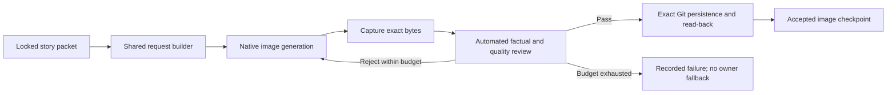

# Automated image execution — production and qualification parity

## September 28, 2026 — Visual-only native generation task delivery

> [!IMPORTANT]
> Use `visual-only-task-delivery-v1` alongside the unchanged V2 image gates. The supervisor prepares and verifies an automatic image-only task whose prompt is the exact compiled visual instruction. Do not put GitHub, run status, capture, review, retry or continuation instructions into that task prompt. No owner-created chat or manual transfer is required; hidden context isolation is not asserted.

`_generator/lib/native-image-delivery.mjs` and `_tools/native-image-delivery.mjs` bind the actual submitted task text and select the next safe unfinished operation. Recover existing generated bytes, complete exact Git capture/read-back and rejection review before allocating another attempt. A pending task is not permission to duplicate generation; four attempts remain the maximum. A preserved Library copy is not a Git receipt, and a compiler/test PASS is not successful native generation. The execution host must still demonstrate scheduling, native output recovery, review and exact persistence.

See [Native image task delivery](native-image-task-delivery.md). Preserve frozen Q24 requests, its five completed components, cutoff/policies, failed outputs and earlier receipts. No acceptance gate, historical result or public edition is changed by this repair. Protected CI and normal merge are required before adoption; actual corrected-image and unattended-production proof remain separate.

---

> [!IMPORTANT]
> **Owner direction, September 28, 2026:** testing must use the production image path, with no manual intervention in image generation. Production must be automated. `production-image-execution-v2` supersedes the requirement for owner-created fresh conversations and mandatory Library/worker-exit handoffs for new image work. It does not convert historical failed runs into passes.

## One execution path

| Concern | Production and qualification |
|---|---|
| Request construction | `_generator/lib/image-execution.mjs`, `buildImageGenerationExecution` |
| Qualification entry point | Direct alias of the production function, not a second implementation |
| Generation | Native ChatGPT image generation, one frozen story packet per request, one output at a time |
| Context evidence | `request_scope=sealed_story_payload_only`; `runtime_context_isolation=not_asserted` |
| Manual steps | No owner chat creation, file upload, Library transfer, manual review, or approval prompt |
| Review | Automated after generation against exact final bytes; same or separate execution context is allowed |
| Failed output | Retain evidence; generate a fresh request for that story, up to four attempts; never edit a wrong-subject image into compliance |
| Persistence | Exact reviewed bytes, SHA-256, Git blob SHA-1, durable path and actual read-back comparison |
| Recovery | Revalidate the bound request and exact accepted bytes, then reuse without regeneration |
| Publication | Still requires six distinct accepted/locked professional images and all existing quality/manifest/deployment gates |



`includes_edition_context=false` describes the explicit request payload. It is not proof that the platform strips hidden or ambient conversation context. V2 intentionally does not require an unsupported `inherit_parent_context=false` assertion. Actual wrong-subject, cross-story, unsupported-fact, low-quality and byte-mismatch outcomes remain failures. Detailed benchmark comparison and six-image differentiation in `image-gate.mjs` are unchanged.

## Executable contract and proof

`executeImageRequest` and `executeImageBatch` coordinate generation, automatic review, bounded retry, persistence and read-back through execution-host adapters. They do not themselves create a ChatGPT session or call a paid image API. The execution host must actually expose native generation, automatic raw-file capture, review and exact-file transport. Missing capabilities produce `CAPABILITY_BLOCKED`, **not** a request for the owner to generate or upload files.

The host must supply a durable event sink. Every generation request is recorded before execution; generated artifact identity/hash, durable raw-file capture/read-back, rejected output, review, persistence and failures are retained. The new receipt binds the request, native call/output identifiers, raw and final hashes, actual review, invocation-cost declarations and persistence evidence. Account billing remains unobserved. No Work, Codex or paid model API adapter is added or authorized.

Prepare six current-edition requests with:

```sh
node _tools/image-execution.mjs prepare --packets <sealed-six-story-packets.json> --out <request-directory>
```

This command is an internal runner step, not an owner task. Its output is `REQUESTS_READY`, **not** image-generation completion. The active execution host consumes each request and invokes native generation automatically. It must not tell the owner to open a new chat or upload an image. The native tool's actual exposed schema governs invocation; never invent an unsupported isolation or prompt parameter.

Validate a completed live receipt against the accepted file with:

```sh
node _tools/image-execution.mjs validate-receipt --execution <request.json> --receipt <receipt.json> --asset <accepted-image.png>
```

For editions dated September 28, 2026 and later, the production combined image gate requires V2 request/receipt evidence in addition to every existing structural/editorial check. Earlier editions retain historical validation. New records cannot opt out by omitting the policy field. The original IH9 builder/validator remain explicitly named `buildLegacyQualificationImageGenerationExecution` and `validateLegacyQualificationImageGenerationExecution` for archival replay only.

## What counts as unattended evidence

| Evidence | Meaning |
|---|---|
| Unit/adapter fixture PASS | Shared orchestration logic tested; never live image or production proof |
| Active-chat native run | No manual image handoff required during that invocation; not scheduled proof |
| Six scheduled native receipts plus full final gates | Evidence of an unattended image stage; full Brief closure is separately required |
| Enabled schedule, empty request files, or passing JSON validator alone | Not execution evidence |

The automated-production objective is not marked achieved by this code change alone. A genuine scheduled run must demonstrate available native generation, automatic artifact capture/review/persistence, six accepted images and end-to-end closure. An active-chat tool list cannot establish scheduled-runtime capability. An execution host that is absent cannot be replaced with self-certified receipts.

## Q24 adoption and preserved work

Q24's six-story order is m04, m03, m05, m06, m01, m09. Preserve its original cutoff, article/media policies, five completed components and all frozen input blobs. Record this image-execution amendment separately; do not modify the existing semantic or media receipts, restart article/media/watchlist discovery, allocate a competing Q25, or relabel Q22/Q23/IH failures. The fixed older IH story set is historical and does not determine the current edition order.

## Verification obligations

Test identical production/qualification requests; rejection of manual steps and false isolation claims; sequential generation; wrong-subject/factual/quality rejection; four-attempt exhaustion; exact-byte read-back; accepted checkpoint reuse; changed-byte/request rejection; missing native capability; and exclusion of fixtures from live approval. Preserve full historical benchmark regression tests. Release only through protected pull-request CI.
