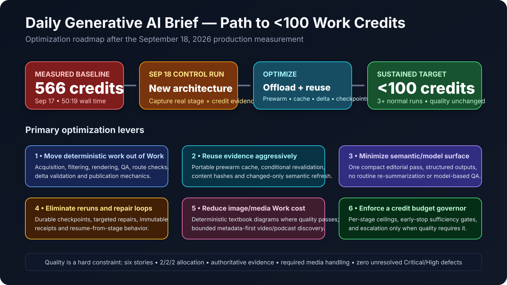
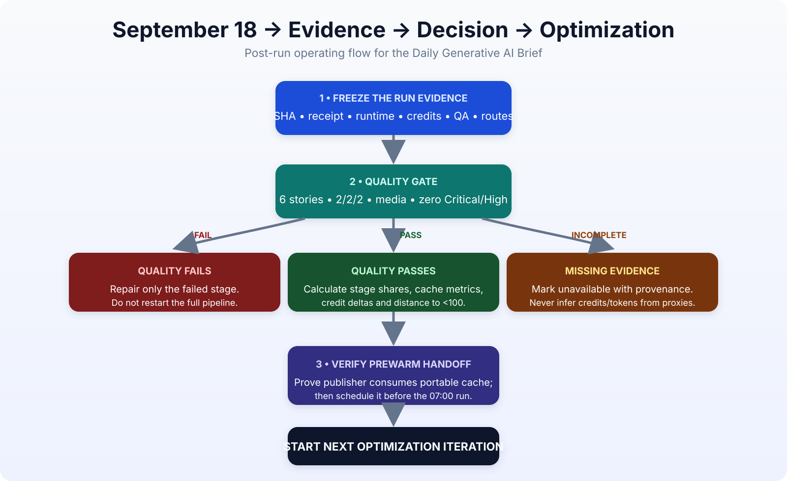

# Daily Generative AI Brief — Post–September 18 Handoff & Optimization Roadmap

> **Status:** 🟠 **PRE-RUN HANDOFF — revise after the September 18, 2026 Brief completes**  
> **Repository:** `gttome/Daily-AI-Brief`  
> **Production branch:** `main`  
> **Production anchor at handoff creation:** `e19d8284c3a77fe4827201340c67b7438019100f`  
> **Primary objective:** drive the **Daily Brief publisher below 100 owner-observed Work credits per normal run** while preserving or improving reliability, editorial quality, freshness, accessibility, security, and rollback safety.



---

## 1. Purpose of this handoff

This document is the working handoff for the first production run after the September 17 efficiency implementation was promoted to `main`. It has two jobs:

1. define exactly what must be captured, verified, compared, and recorded after the **September 18, 2026** Brief run; and
2. define the next optimization program aimed at materially reducing **Work credits** and **wall-clock time** without weakening any production quality or security gate.

This is deliberately a **pre-run draft**. Do not fill unknown September 18 results with estimates. After the September 18 Brief completes, replace the placeholders in §6 and revise the priorities in §9–§12 using actual observed evidence.

### Non-negotiable principle

**Optimize around the quality gates, not through them.** A run that is slower or more expensive than the target but passes quality must be reported truthfully. Do not lower story quality, freshness, evidence standards, required media handling, accessibility, route integrity, rating/share behavior, rollback safety, or Command Center security merely to improve a metric.

---

## 2. Current production state before the September 18 run

The September 17 efficiency revision has been promoted to production. The production state at the time this handoff was created is:

| Area | Verified state before Sep 18 |
|---|---|
| Production `main` | `e19d8284c3a77fe4827201340c67b7438019100f` |
| PR #117 | Merged into `main` |
| Post-merge deterministic publication CI | **PASS** — run `35276907406` |
| Post-merge GitHub Pages build/deploy | **PASS** — run `35276906646` |
| Main protection | Active ruleset `23615327`; PR required; strict `validate`; no bypass actors; deletion/non-fast-forward blocked |
| Efficiency policy effective date | September 18, 2026 |
| Normal metadata candidate ceiling | 20 |
| Normal deep-review target | 9 |
| Deep-review exception ceiling | 12 |
| Normal retrieved-character budget | 1.5M |
| Absolute retrieved-character ceiling | 2.5M |
| Research capsule target | 9,000 chars |
| Normal editorial context target | 6,500 chars |
| Normal semantic/editorial passes | 1 |
| Routine post-editorial model calls | 0 |
| Routine validation model calls | 0 unless deterministic resolution is insufficient |
| Watchlist | shared acquisition + changed-only semantic refresh design |
| Reader ordering for new editions | Agents → Knowledge Workers → Technical |
| Prewarm workflow | installed on `main`, **manual-only** (`workflow_dispatch`) before Sep 18 |

### Measurement baseline

The latest owner-observed pre-promotion benchmark is:

> 🔴 **September 17, 2026:** **566 Work credits** and **50:19 wall time**.

Treat the 566-credit number as **owner-observed usage evidence**, not platform-attributed per-stage telemetry. Preserve that provenance in every comparison.

The September 18 run is the first production measurement of the new efficiency architecture. It is therefore the control point for the next optimization tranche.

---

## 3. What must happen immediately after the September 18 Brief run



Perform the following in order. Do not begin another major optimization until the evidence package is complete enough to explain where the September 18 credits and time went.

### 3.1 Freeze the production evidence

Capture and preserve:

- final production `main` SHA associated with the September 18 edition;
- publication attempt ID / receipt and pipeline version;
- publisher start time, end time, and actual wall-clock duration;
- owner-observed Work credits consumed by the publisher run;
- if available, before/after usage screenshots or other owner evidence with observation time;
- publication PR/commit(s), CI runs, Pages deployment run and final live-route result;
- any repair PR, targeted repair cycle, retry, restart, recovery action, or manual intervention;
- final quality result and unresolved defect severity, if any.

**Do not** rewrite historical failure evidence. If a stage failed and later recovered, retain both the failure and recovery.

### 3.2 Capture the complete efficiency telemetry set

Record every available raw measurement before calculating derived metrics.

| Measurement family | Capture after Sep 18 |
|---|---|
| Work usage | owner-observed credits consumed; observation method/time; exact/unavailable distinction |
| Timing | total publisher wall time plus stage timings where observable |
| Candidate funnel | metadata candidates; filtered candidates; deep candidates; selected 6; rejected/backup counts |
| Retrieval | sources scanned; retrievals; failures; bytes/chars; full-text vs metadata retrievals |
| Cache | hits; misses; conditional revalidations; `304 Not Modified`; hit rate |
| Context | evidence-packet chars; research capsule size; editorial context size; compression ratio |
| Model use | observable model-call count; semantic passes; any escalation calls; token metrics only if genuinely observable |
| Images | attempts; deterministic attempts; generative fallbacks; rejects; accepted 6; quality-gate failures |
| Videos | metadata candidates; trusted-source candidates; deep-reviewed finalists; selected count; duration-tier use |
| Podcasts | metadata candidates; selected count; source diversity; freshness tier |
| Watchlist | changed/carried/new topics; semantic refresh count; failed-source retry count |
| QA | deterministic tests; contract checks; route checks; live smoke; model escalation count |
| Repairs | targeted repair count; full restart count; repair time; repair share of total runtime |
| Publication | PR count; commits; Pages deploy; live verification |

For any unavailable metric, record **why it is unavailable**. Do not infer tokens, credits, private metrics, or per-stage costs from weak proxies.

### 3.3 Apply the quality gate before interpreting savings

The September 18 efficiency result is only comparable if the edition preserves the operating quality baseline:

- exactly **6 stories**;
- canonical **2 Technical + 2 Knowledge Worker + 2 Agents/Non-technical** allocation;
- authoritative evidence and required novelty checks;
- qualifying Agent Skills coverage where required by current policy;
- six acceptable story-specific images;
- required video handling and bounded-discovery evidence when a slot cannot be filled;
- podcast handling under current source-diversity rules;
- permanent article/media routes, archive/feed parity and reading-time behavior;
- rating/share behavior and privacy contract;
- accessibility and deterministic CI;
- append-only corrections and stable URLs;
- zero unresolved **Critical/High** defects.

If quality fails, repair the failed stage and record the repair separately. **Do not restart the entire pipeline unless the failure invalidates the pipeline state.**

---

## 4. September 18 comparison calculations

Once the raw evidence is frozen, calculate at minimum:

- credit change vs September 17: `(Sep18 credits - 566) / 566`;
- wall-time change vs September 17: `(Sep18 wall time - 50:19) / 50:19`;
- credits per selected story;
- credits per elapsed minute;
- cache-hit rate;
- retrieval-volume change vs the active baseline;
- metadata-to-deep-review reduction rate;
- deep-review-to-selection rate;
- raw-source-to-editorial-context compression ratio;
- repair-overhead share of wall time;
- stage share of total wall time;
- distance to the **<100-credit** target;
- distance to provisional wall-time targets in §11.

### Required interpretation discipline

A lower credit total does **not** by itself prove every new optimization worked. Separate, as far as the evidence allows:

- workload differences on September 18;
- cache behavior;
- source availability;
- image generation/recovery burden;
- media availability;
- Watchlist changes;
- repair activity;
- publisher/model behavior;
- deterministic processing and CI overhead.

---

## 5. Prewarm decision after September 18

### 5.1 Intended end state

The acquisition prewarm is intended to become a normal daily optimization **if and only if the publisher actually consumes the warmed cache**.

Current prewarm behavior:

- metadata-only;
- maximum of 12 high-priority endpoints;
- concurrency in bounded groups;
- no semantic/model work;
- GitHub Actions cache at `.cache/dab-retrieval`;
- cache TTL currently one hour in the retrieval implementation;
- workflow currently manual-only.

### 5.2 Why it is not automatically scheduled yet

The repository proves the GitHub Actions prewarm cache is produced and restored within Actions. It does **not yet prove** that the separate 07:00 Work publisher can consume that same persisted cache across the execution boundary.

Running a daily prewarm without proving that handoff risks adding network/Actions activity without materially reducing Work credits or publisher wall time.

### 5.3 Post-run prewarm experiment

After the September 18 baseline is captured:

1. identify the publisher's actual cache location and lifecycle;
2. run prewarm manually and retain its receipt/artifact;
3. prove that the subsequent publisher/integrated acquisition sees those entries as hits or conditional revalidations rather than independent cold misses;
4. verify freshness remains correct and stale entries are revalidated;
5. verify no private data or credentials enter the portable cache;
6. compare acquisition wall time, cache-hit rate, bytes/chars downloaded and Work credits;
7. only then promote prewarm to a daily scheduled optimization.

### 5.4 Proposed permanent schedule after proof

If the cross-environment cache handoff is proven, schedule prewarm approximately **06:15–06:30 America/Chicago** for the normal **07:00 publisher** so direct cache hits remain inside the one-hour TTL. Preserve DST correctness.

The exact schedule must be treated as a production change and validated independently before activation.

---

## 6. September 18 results — fill after the run

> 🟡 **PLACEHOLDER SECTION — do not estimate. Replace with observed evidence after the run.**

| Metric | Sep 17 baseline | Sep 18 actual | Change | Evidence/provenance |
|---|---:|---:|---:|---|
| Work credits — publisher | 566 | TBD | TBD | Sep 17 owner-observed; Sep 18 TBD |
| Wall time | 50:19 | TBD | TBD | attempt timing |
| Metadata candidates | TBD | TBD | TBD | publication telemetry |
| Deep candidates | TBD | TBD | TBD | publication telemetry |
| Cache hits | TBD | TBD | TBD | retrieval telemetry |
| Cache misses | TBD | TBD | TBD | retrieval telemetry |
| Conditional revalidations | TBD | TBD | TBD | retrieval telemetry |
| 304 responses | TBD | TBD | TBD | retrieval telemetry |
| Retrieved chars | TBD | TBD | TBD | retrieval telemetry |
| Editorial context chars | TBD | TBD | TBD | context telemetry |
| Semantic/model calls | TBD | TBD | TBD | observable call telemetry |
| Image attempts / rejects | TBD | TBD | TBD | image receipt |
| Videos selected | 2 target | TBD | — | media receipt |
| Podcasts selected | 2 target when qualifying | TBD | — | media receipt |
| Watchlist topics semantically refreshed | TBD | TBD | TBD | delta receipt |
| Repair cycles | TBD | TBD | TBD | attempt/QA receipts |
| Critical/High defects | 0 target | TBD | — | final QA |

### Post-run conclusion placeholder

- **Quality gate:** `TBD`
- **Efficiency gate:** `TBD`
- **Primary bottleneck:** `TBD`
- **Largest avoidable Work-credit consumer:** `TBD`
- **Largest avoidable wall-time consumer:** `TBD`
- **Prewarm handoff priority:** `TBD`
- **Next optimization iteration selected:** `TBD`

---

## 7. Ultimate optimization goal

### Target

> 🟢 **Sustained normal publisher runs below 100 owner-observed Work credits per Brief.**

“Achieved” should mean at least **three consecutive representative normal runs** below 100 credits with the full quality gate passing and no hidden manual work moved outside the recorded attempt.

### Provisional sub-100 credit budget

This is a planning allocation, **not measured telemetry**. Revise it after September 18.

| Stage | Provisional Work-credit budget | Design intent |
|---|---:|---|
| Acquisition + metadata filtering + cache management | **0–5** | deterministic/offloaded; Work sees compact evidence, not raw discovery |
| Semantic editorial selection + writing | **35–45** | one compact structured editorial pass |
| Visuals + media semantic work | **20–25** | deterministic diagrams/metadata-first media; generative fallback only when quality requires |
| Assembly + deterministic QA + publication | **0–5** | no routine model work |
| Exception reserve | **10–15** | source ambiguity, novelty conflict, quality escalation |
| **Total target** | **65–95** | leaves headroom below 100 |

The architecture should be designed so a normal run can satisfy the Brief contract without consuming the exception reserve.

---

## 8. Optimization strategy

The fastest path to <100 credits is **not** to make the model slightly more concise. It is to shrink the amount of work that needs Work/model intelligence at all.

The next program should pursue four architectural principles:

1. **Deterministic first:** move deterministic retrieval, filtering, hashing, rendering, validation, route checks and publication mechanics out of Work wherever safely possible.
2. **Evidence once, reuse many times:** content-addressed cache, conditional revalidation, evidence capsules and unchanged-state carry-forward.
3. **Semantic work only at decision boundaries:** one editorial pass; model escalation only for genuinely ambiguous evidence or quality failures.
4. **Never rerun unaffected stages:** checkpoint every expensive stage and repair only the invalidated dependency chain.

---

## 9. Next optimization iterations

Priorities below are intentionally aggressive. Reorder them after the September 18 evidence identifies the real bottlenecks.

### Iteration 1 — Complete cost and stage observability

**Objective:** make every optimization measurable and prevent credit/time regressions from hiding inside an aggregate run.

Implement or complete:

- stage-level start/end timestamps for discovery, filtering, deep retrieval, evidence compilation, editorial pass, images, media, Watchlist, generation, QA, publication and live verification;
- explicit model-call counter by stage;
- context-size measurement by stage;
- retrieval chars/bytes by source and stage;
- cache hit/miss/revalidation/304 metrics;
- repair/retry/full-restart counters;
- owner-observed credit snapshot association with the exact attempt ID;
- append-only per-edition efficiency assessment record;
- Command Center trend view for credits, runtime, cache efficiency, repairs and quality.

**Value:** without this, sub-100 work becomes guesswork.  
**Reliability impact:** high positive.  
**Expected Work-credit leverage:** indirect but foundational.

---

### Iteration 2 — Prove portable prewarm cache and schedule it daily

**Objective:** remove avoidable acquisition latency from the 07:00 Work critical path.

Implement:

- a portable, content-addressed metadata cache contract usable by GitHub Actions and the publisher;
- cache manifest with URL, content hash, fetched time, TTL, ETag/Last-Modified and provenance;
- integrity validation before publisher reuse;
- conditional revalidation for expired entries;
- prewarm receipt linked to publisher attempt receipt;
- daily 06:15–06:30 America/Chicago prewarm only after the handoff is proven;
- failure isolation so a failed prewarm never blocks the publisher.

**Value:** lower cold-source latency and fewer duplicate network fetches.  
**Reliability impact:** positive if stale/failure handling remains explicit.  
**Expected Work-credit leverage:** potentially meaningful, but must be measured after handoff proof.

---

### Iteration 3 — Move deterministic work out of Work

**Objective:** reserve Work intelligence for editorial judgment rather than orchestration.

Candidates for deterministic/offloaded execution:

- source registry loading and endpoint planning;
- metadata retrieval and normalization;
- URL/date/category validation;
- duplicate/event-fingerprint filtering;
- 30-day novelty precheck where it can be deterministic;
- candidate scoring heuristics before semantic review;
- unchanged Watchlist topic carry-forward;
- static page generation and derived fields;
- reading-time calculation;
- archive/feed generation;
- route/integrity validation;
- deterministic accessibility checks;
- publication receipt generation;
- Command Center public-safe delta packet generation;
- standard post-publication QA.

Work should receive a compact, validated evidence contract rather than raw repository state plus raw source payloads.

**Value:** likely one of the largest paths to the <100-credit target.  
**Reliability impact:** positive because deterministic contracts are repeatable and testable.

---

### Iteration 4 — Content-addressed evidence store and cross-run reuse

**Objective:** stop paying repeatedly to rediscover and re-understand unchanged evidence.

Implement:

- cache key = normalized URL + evidence kind + source-content hash;
- durable evidence capsules with claim/source traceability;
- reuse across Brief, Watchlist, media screening and validation;
- unchanged-source semantic result reuse with strict freshness rules;
- source delta detection so only changed content re-enters semantic review;
- compact 30-day novelty/event index rather than broad historical rereads;
- explicit invalidation when source content, policy, or review version changes.

**Value:** reduces repeated retrieval, repeated summarization and repeated semantic reasoning.  
**Reliability impact:** positive if invalidation rules are strict.

---

### Iteration 5 — Adaptive candidate budgets and earlier stopping

**Objective:** stop discovery/deep review as soon as the editorial contract is safely satisfiable.

Current normal limits remain 20 metadata candidates / 9 deep reviews / 12 exception ceiling. Use September 18 data to test whether normal runs can safely operate below those ceilings.

Candidate improvements:

- rank trusted primary sources first;
- category-specific sufficiency counters;
- stop metadata discovery once each category has enough strong candidates plus backups;
- stop deep retrieval immediately when the three-category sufficiency gate and Agent Skills requirement are satisfied;
- avoid full text for candidates eliminated by date, duplicate, source, topic, or event fingerprint;
- dynamically lower candidate ceilings on high-signal days;
- preserve the exception path for thin-news days.

**Value:** directly reduces retrieval, context, semantic evaluation and wall time.  
**Guardrail:** never let the efficiency stop condition override freshness, 2/2/2 allocation or evidence quality.

---

### Iteration 6 — Editorial pass compression

**Objective:** make the one remaining semantic pass smaller, more structured and more reusable.

Implement/test:

- strict structured input containing evidence capsules only;
- remove repository prose, repeated policies and already-derived values from model context;
- send policy IDs/hashes rather than full unchanged policy text when safe;
- structured output contract containing selection, story text, rationale, uncertainty and only fields requiring judgment;
- derive reading time, links, route metadata, archive entries, labels and layout deterministically;
- no routine “review your answer,” re-summarization, or second editorial rewrite pass;
- semantic escalation only for named unresolved conflicts.

**Value:** direct reduction in Work/model context and output volume.  
**Reliability impact:** positive if schema validation rejects malformed outputs before publication.

---

### Iteration 7 — Visual pipeline cost reduction without quality regression

**Objective:** preserve the September 17 professional textbook baseline while reducing expensive retries and model-dependent image work.

Implement/test:

- promote deterministic diagram rendering only for story classes where it demonstrably meets or exceeds the visual baseline;
- story-to-layout classifier using deterministic features where possible;
- reusable layout grammar for process, layered architecture, hub/spoke, lifecycle, compare/decision, pipeline, control/approval, evidence verification, annotated system and composite diagrams;
- validate typography, node count, density, clipping, contrast and 1200×630 output deterministically;
- use generative image production only as the quality fallback;
- content-address approved images so retry/recovery never regenerates an already accepted image;
- checkpoint each accepted image independently.

**Value:** potentially large wall-time and Work reduction on image-heavy runs.  
**Guardrail:** no low-information placeholders and no quality downgrade to satisfy a cost target.

---

### Iteration 8 — Media discovery fully metadata-first

**Objective:** keep video/podcast discovery off the expensive semantic path until the finalist set is very small.

Implement/test:

- deterministic publisher/source trust filtering;
- duration parsing before semantic review;
- freshness/source-diversity checks before semantic review;
- title/description fingerprint dedupe;
- only the strongest 3–5 video candidates deep-reviewed;
- podcast source-diversity enforcement deterministically;
- cache media metadata independently of story evidence;
- no model call when a candidate can be accepted/rejected by policy metadata alone.

**Value:** lower retrieval/context cost and faster media fill.

---

### Iteration 9 — Checkpoint/resume and targeted repair architecture

**Objective:** eliminate catastrophic credit waste from full reruns.

Persist durable completion receipts after:

1. acquisition;
2. candidate filtering;
3. evidence compilation;
4. editorial selection/writing;
5. each accepted image;
6. media selection;
7. Watchlist delta;
8. deterministic generation;
9. CI/QA;
10. publication/live verification.

Each checkpoint should include input hashes and dependency hashes so a repair invalidates only downstream stages that actually depend on the changed artifact.

Examples:

- failed image → regenerate only that image;
- broken route → regenerate/validate affected route set, not editorial research;
- media slot failure → rerun media selection only;
- Command Center sync failure → retry sync only;
- Pages deployment failure → retry deployment/live verification, not content generation.

**Value:** major reliability gain and potentially very large savings on failure days.

---

### Iteration 10 — Credit budget governor and runaway protection

**Objective:** make exceeding the credit target an explicit controlled exception rather than an invisible outcome.

Implement a policy-driven governor with:

- normal per-stage Work budgets;
- hard deterministic retrieval/context ceilings;
- semantic-call ceilings;
- named escalation reasons;
- early-stop sufficiency checks;
- no automatic full rerun after budget exhaustion;
- pause/escalate state when quality cannot be satisfied within the normal budget;
- owner-visible reason when the run legitimately needs an exception.

The governor must **not** publish a low-quality edition merely to remain under budget.

**Value:** prevents runaway usage and makes exception runs diagnosable.

---

## 10. Reliability optimizations that should accompany the cost work

Cost reduction and reliability should reinforce each other. Prioritize:

- immutable input/output hashes at stage boundaries;
- idempotent publication operations;
- strict UTF-8 and blob integrity checks before PR creation;
- source timeout/circuit-breaker behavior;
- selective retry with backoff rather than broad rescans;
- no repeated polling loops when a webhook/event or one later validation can suffice;
- cached policy/version fingerprints;
- deterministic route manifest and live-route diff;
- append-only incident and correction evidence;
- explicit degraded-mode classification rather than silent substitution;
- rollback by additive revert commits only;
- no weakening of `main` ruleset `23615327`;
- owner authentication for private/administrative Command Center operations while retaining link-accessible read-only viewer behavior.

---

## 11. Provisional wall-time goals

Credit usage is the primary optimization target, but wall time should fall as the same architecture removes repeated work.

These are **experiment targets**, not current guarantees:

| Milestone | Publisher wall-time goal | Condition |
|---|---:|---|
| Near-term | **<30 minutes** | quality gate passes; no major source outage |
| Intermediate | **<20 minutes** | portable cache + deterministic offload + checkpointing active |
| Stretch | **<15 minutes** | high cache reuse and no generative-image recovery loop |

Do not classify a quality-passing run as defective solely because it misses an experiment timing target.

---

## 12. Promotion gates for future optimizations

Every optimization should move through the same sequence:

1. **Implement on a branch.**
2. **Unit/contract test.**
3. **Shadow against immutable production evidence where possible.**
4. **Prove no historical output mutation.**
5. **Measure the target stage before/after.**
6. **Verify zero new Critical/High defects.**
7. **Merge through protected `main` only after required CI passes.**
8. **Run a real production measurement.**
9. **Retain both successful and failed experiment evidence.**

Avoid stacking several unmeasured high-impact changes into the same experiment unless operational necessity requires it; attribution matters if the goal is sustained sub-100 performance.

---

## 13. Recommended priority order after the September 18 data is available

Unless the data shows a different dominant bottleneck, begin in this order:

| Priority | Optimization | Why first |
|---:|---|---|
| **1** | Complete stage/model/context telemetry | enables trustworthy attribution |
| **2** | Verify portable prewarm cache handoff | existing feature can become a daily accelerator once proven |
| **3** | Move deterministic acquisition/QA/publication work out of Work | likely largest structural reduction in Work usage |
| **4** | Durable evidence cache + changed-only semantic review | removes repeated reasoning across days/components |
| **5** | Adaptive early stopping | reduces retrieval and deep-review volume |
| **6** | Editorial context/output compression | reduces the one semantic pass |
| **7** | Deterministic visual promotion where quality passes | attacks image retries/model burden |
| **8** | Media metadata-first hardening | keeps media off semantic path |
| **9** | Full checkpoint/resume dependency graph | prevents expensive failure reruns |
| **10** | Credit budget governor | makes sub-100 the normal enforced operating envelope |

---

## 14. Definition of success

The optimization program is successful when all of the following are true:

### Efficiency

- normal publisher run is **<100 owner-observed Work credits** for at least 3 consecutive representative editions;
- no hidden manual/model work is excluded from the measurement;
- wall time shows sustained material improvement from the September 17 50:19 baseline;
- routine post-editorial validation remains zero-model unless a named exception is required.

### Reliability

- zero unresolved Critical/High defects;
- no routine full reruns;
- failed stages resume from valid checkpoints;
- retrieval/source failures are isolated and selectively retried;
- publication remains atomic and rollback-safe;
- historical editions remain immutable except append-only corrections.

### Quality

- six-story 2/2/2 contract preserved;
- authoritative verification and freshness remain intact;
- visual quality stays at or above the September 17 baseline;
- media handling remains policy-compliant;
- public route/archive/feed/rating/share/accessibility behavior remains correct.

### Security and operations

- protected `main` remains enforced;
- no bypass actors added;
- viewer/owner Command Center access semantics remain intact;
- private owner data is never written to public Git;
- credits/private usage remain provenance-labeled owner observations unless the platform exposes exact attribution.

---

## 15. Post–September 18 revision instructions

After the September 18 Brief completes, update **this same file** rather than creating a disconnected replacement.

Required revision:

1. replace §6 placeholders with the actual run metrics and evidence references;
2. add final September 18 production SHA, attempt ID, CI run and Pages deployment;
3. record the exact owner-observed publisher credits and wall time;
4. explain major workload differences vs September 17;
5. identify the top 3 credit consumers and top 3 wall-time consumers supported by evidence;
6. state whether the quality gate passed;
7. decide whether the prewarm handoff is the next experiment;
8. reorder §9 and §13 based on measured bottlenecks;
9. assign explicit acceptance metrics to the next implementation branch;
10. retain the September 17 and September 18 measurements as immutable comparison anchors.

### Suggested next-session handoff prompt

```text
Continue the Daily Generative AI Brief post–September 18 efficiency program.

Repository: gttome/Daily-AI-Brief
Primary branch: main

Read docs/operations/post-2026-09-18-brief-handoff-and-optimization-roadmap.md first.
Fetch the current main SHA and the complete September 18 publication/validation evidence before proposing or implementing changes.

Update the handoff's September 18 results section with verified metrics, preserving provenance. Compare against the September 17 baseline of 566 owner-observed Work credits and 50:19 wall time.

Then identify the measured dominant Work-credit and wall-time bottlenecks, revise the priority order, and implement only the next approved optimization tranche on a protected implementation branch. Preserve all quality, security, rollback, and historical-output constraints. The long-term target is a sustained normal publisher run below 100 Work credits without reducing Brief quality.
```

---

## 16. Decision log

| Date | Decision | Rationale |
|---|---|---|
| 2026-09-17 | Promote PR #117 efficiency implementation to production for Sep 18 | final branch verification and protected-main post-merge CI passed |
| 2026-09-17 | Do not auto-schedule acquisition prewarm before first Sep 18 measurement | preserve a clean first production measurement and verify cross-environment cache consumption before making it daily |
| 2026-09-17 | Treat daily prewarm as intended future steady state once handoff is proven | metadata-only prewarm should reduce critical-path acquisition only if publisher actually reuses its cache |
| 2026-09-17 | Set long-term publisher target below 100 Work credits | owner objective; quality remains a hard constraint |

---

## 17. Source-of-truth references

Use these repository sources together with the actual run receipts when revising this handoff:

- `docs/operations/efficiency-operating-policy-2026-09-17.md`
- `docs/operations/efficiency-operating-policy.json`
- `docs/operations/efficiency-assessment-policy.md`
- `docs/operations/publisher-runbook.md`
- `docs/operations/watchlist-runbook.md`
- `.github/workflows/acquisition-prewarm.yml`
- `.github/workflows/daily-delta-validation.yml`
- `.github/workflows/post-editorial-kernel.yml`
- `_tools/prewarm-acquisition.mjs`
- `_generator/lib/research.mjs`

> **Next mandatory revision point:** immediately after the September 18, 2026 Brief publisher and its associated validation evidence are available.
